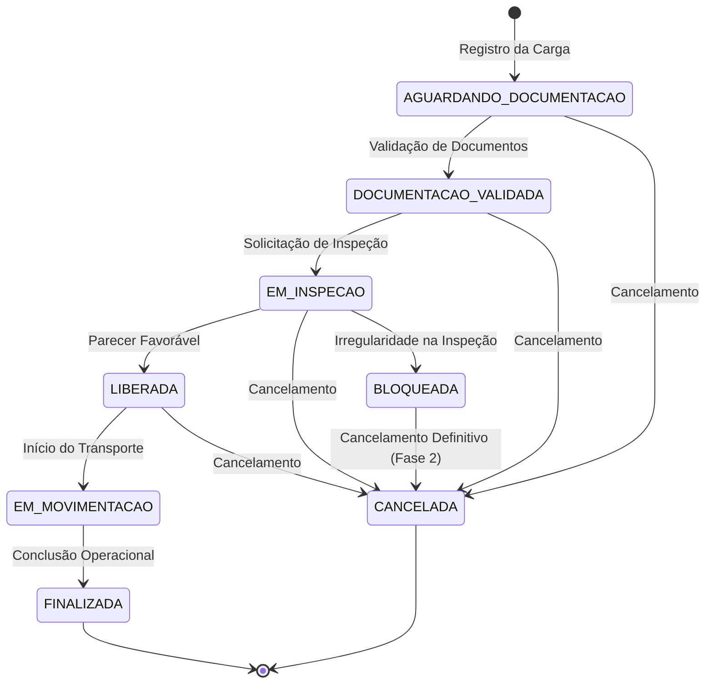

# 📘 1. Entendimento do Domínio e Contexto

---

## 1.1 Contexto

O ecossistema portuário brasileiro, exemplificado pelas operações do Porto de Santos (o maior complexo portuário da América Latina), lida diariamente com a movimentação de milhões de toneladas de mercadorias. Dentre esses fluxos, o transporte, o transbordo e o armazenamento de produtos e cargas químicas representam operações de altíssima complexidade e criticidade regulatória.

A gestão inadequada dessas cargas pode resultar em acidentes ambientais severos, contaminação de águas e solos, incêndios, explosões e penalidades regulatórias por parte de órgãos como ANTAQ, IBAMA, Anvisa e Capitania dos Portos.

---

## 1.2 Problema

Atualmente, diversas operações de logística portuária enfrentam gargalos na gestão de cargas perigosas decorrentes de:

- Processos descentralizados de verificação de documentação obrigatória;
- Dificuldade de rastreabilidade do responsável técnico habilitado para autorizar o manuseio dos materiais;
- Falta de controle rígido e auditável das etapas de inspeção e status das cargas (desde a chegada ao terminal até a liberação final);
- Risco de movimentação indevida de materiais com laudos vencidos, produtos inativos ou inconformidades de classificação de risco.

---

## 1.3 Objetivo da Solução

O **QuimiPort** é uma solução de software orientada ao domínio logístico-portuário desenvolvida para centralizar, validar e rastrear todo o ciclo de vida das cargas químicas no terminal. A aplicação atua como um motor de regras de conformidade e segurança, garantindo que nenhuma carga química seja movimentada ou liberada sem que todos os requisitos operacionais, legais, ambientais e de responsabilidade técnica estejam rigorosamente atendidos.

---

## 1.4 Escopo da Atual vs. Escopo Futuro

### Escopo Atual - Fase 1

O escopo atual contempla o desenho arquitetural, a modelagem de domínio com Domain-Driven Design (DDD), a especificação de regras de negócio, casos de uso, transições de estado, estratégias de testes e a estruturação do projeto em TypeScript com Clean Architecture.

> **Importante:** Em estrita conformidade com os requisitos do Tech Challenge, **nenhum código de infraestrutura, banco de dados, frontend ou API REST foi implementado de forma definitiva**. Esta documentação apresenta o _blueprint_ arquitetural e teórico que sustentará a implementação nas fases subsequentes.

### Escopo Futuro

- **Fase 2:** Implementação do ecossistema Backend em Node.js/TypeScript, persistência de dados transacional, API RESTful e autenticação/autorização por perfis.
- **Fase 3:** Desenvolvimento do Frontend Web interativo, _dashboards_ de monitoramento operacional em tempo real e integração do pipeline de CI/CD.
- **Fases Avançadas:** Módulo _mobile_ para inspetores de campo, integração via rotas assíncronas/eventos com sistemas externos (ex.: Siscomex, sistemas dos terminais portuários) e alertas em tempo real.

---

## 1.5 Perguntas Fundamentais do Domínio

- **Qual problema está sendo resolvido?** A ausência de um mecanismo centralizado, auditável e automatizado para garantir que cargas químicas só transitem pelo porto se estiverem acompanhadas de produtos ativos, responsáveis técnicos válidos, documentação ambiental em dia e inspeção aprovada.
- **Quem utiliza o sistema?** Operadores portuários, analistas de documentação, inspetores de segurança, gestores operacionais e administradores.
- **Quais informações precisam ser controladas?** Dados do produto químico (ONU, Classe de Risco, FDS), dados da carga (peso, volume, lote, contêiner), documentação legal, dados do responsável técnico (CRQ/CREA), registros de inspeções e o histórico imutável de transições de status.
- **Quais decisões precisam ser tomadas pelo sistema?** Autorizar ou negar a liberação de uma carga; permitir ou impedir a movimentação física; bloquear automaticamente cargas em inconformidade; inativar produtos que não podem mais ser operados.
- **Quais riscos existem?** Liberação indevida de carga sem FDS/FISPQ; movimentação de produtos incompatíveis ou sem laudo de segurança; perda de rastreabilidade do engenheiro/químico responsável; movimentação de carga com status `BLOQUEADA` ou `CANCELADA`.
- **Quais restrições existem?** Cumprimento rigoroso das normas da ANTT (transporte terrestre de produtos perigosos) e do Código IMDG (_International Maritime Dangerous Goods_).

---

## 1.6 Atores e Perfis Operacionais

| Ator                                 | Responsabilidade Principal                                                           | Objetivo no Sistema                                                                       | Principais Interações                                                                         |
| :----------------------------------- | :----------------------------------------------------------------------------------- | :---------------------------------------------------------------------------------------- | :-------------------------------------------------------------------------------------------- |
| **Operador Portuário**               | Operação e logística de recepção de contêineres e lotes no terminal.                 | Registrar cargas químicas recebidas e consultar a situação operacional para movimentação. | Registrar Carga Química; Consultar Cargas por Status; Consultar Histórico.                    |
| **Analista de Documentação**         | Auditoria e triagem de documentos legais (FDS, Licença de Transporte, Laudos).       | Garantir o _compliance_ documental antes do envio para inspeção ou liberação.             | Registrar Documentos; Validar Documentação Obrigatória; Reprovar Documentos Incompletos.      |
| **Responsável Técnico**              | Profissional de química/engenharia habilitado (CRQ/CREA) legalmente responsável.     | Assumir a responsabilidade técnica pelas especificações e pelo manuseio seguro da carga.  | Vincular-se a Cargas Químicas; Assinar/Aprovar Pareceres Técnicos de Compatibilidade.         |
| **Analista de Qualidade / Inspetor** | Realização de vistorias físicas, amostragem e análise de integridade das embalagens. | Verificar se a carga física condiz com a documentação e as normas de segurança.           | Realizar Inspeção; Solicitar Inspeção; Registrar Parecer da Inspeção (Aprovado/Reprovado).    |
| **Gestor Operacional**               | Gestão de crise, controle de pátio e decisões de exceção operacional.                | Intervir na operação aplicando bloqueios de emergência ou liberando cargas retidas.       | Bloquear Carga Química; Cancelar Carga Química; Liberar Carga Química; Visualizar Relatórios. |
| **Administrador do Sistema**         | Manutenção do cadastro de referência do terminal.                                    | Manter a base de produtos químicos e parâmetros operacionais atualizados.                 | Cadastrar Produto Químico; Inativar Produto Químico; Gerenciar Usuários/Atores.               |

---

## 1.7 Linguagem Ubíqua (Glossário)

| Termo                     | Definição no Contexto do QuimiPort                                                                                                                                                                                                                                |
| :------------------------ | :---------------------------------------------------------------------------------------------------------------------------------------------------------------------------------------------------------------------------------------------------------------- |
| **Produto Químico**       | A substância ou composto químico genérico cadastrado no sistema com suas características técnicas de risco (ex.: Ácido Sulfúrico 98%, Acetona).                                                                                                                   |
| **Carga Química**         | O lote ou remessa física específica de um Produto Químico que dá entrada no terminal portuário, identificada por um número de conhecimento/contêiner e quantidade física.                                                                                         |
| **Classe de Risco**       | Categorização oficial da ANTT/IMDG baseada na periculosidade da substância (Ex.: Classe 3 - Líquidos Inflamáveis, Classe 8 - Corrosivos).                                                                                                                         |
| **Código ONU**            | Número de quatro dígitos que identifica internacionalmente substâncias perigosas segundo a Organização das Nações Unidas (Ex.: UN 1830 para Ácido Sulfúrico).                                                                                                     |
| **Documento Obrigatório** | Registro documental exigido por lei ou norma portuária para autorizar o trânsito da carga (ex.: FDS/FISPQ, Declaração de Cargas Perigosas, Licença Ambiental).                                                                                                    |
| **Documento Vencido**     | Documento cuja `dataValidade` é anterior ao instante da verificação. `EXPIRADO` não é armazenado como status: o vencimento é calculado para evitar estado duplicado ou desatualizado.                                                                             |
| **Responsável Técnico**   | Profissional de Química ou Engenharia devidamente registrado no conselho de classe (CRQ/CREA) responsável pelas diretrizes de segurança da carga.                                                                                                                 |
| **Inspeção**              | Procedimento de vistoria física e verificação preventiva realizado na carga para checar lacres, vazamentos, rotulagem e conformidade da embalagem.                                                                                                                |
| **Liberação**             | Ação formal que altera o estado da Carga Química para autorizar sua movimentação física ou desembarque do terminal.                                                                                                                                               |
| **Bloqueio**              | Ação preventiva ou corretiva que impede qualquer movimentação física ou transição operacional da Carga Química devido a irregularidades ou emergências.                                                                                                           |
| **Status da Carga**       | A etapa exata do ciclo de vida em que a Carga Química se encontra, seguindo a máquina de estados oficial do QuimiPort: `AGUARDANDO_DOCUMENTACAO`, `DOCUMENTACAO_VALIDADA`, `EM_INSPECAO`, `LIBERADA`, `EM_MOVIMENTACAO`, `FINALIZADA`, `BLOQUEADA` e `CANCELADA`. |
| **Invariante**            | Uma regra de negócio estrita e imutável que deve ser mantida verdadeira durante todo o tempo de vida de um Agregado do domínio.                                                                                                                                   |

---

## 1.8 Ciclo de Vida / Fluxo de Status da Carga Química

A máquina de estados da Carga Química no QuimiPort é fechada e exclusiva: apenas os 8 status oficiais e as 11 transições permitidas são válidas, alinhadas estritamente ao fluxo definido no enunciado do Tech Challenge Fase 2. A intenção da modelagem é impedir transições arbitrárias e manter a rastreabilidade operacional de forma auditável.

### Status oficiais

1. `AGUARDANDO_DOCUMENTACAO` — status inicial do registro da carga.
2. `DOCUMENTACAO_VALIDADA` — documentação obrigatória validada pelo sistema e pela operação.
3. `EM_INSPECAO` — carga em vistoria técnica/operacional.
4. `LIBERADA` — carga autorizada para movimentação.
5. `EM_MOVIMENTACAO` — carga em trânsito, descarregamento ou movimentação ativa.
6. `FINALIZADA` — status terminal, concluído operacionalmente.
7. `BLOQUEADA` — carga interditada por irregularidade ou bloqueio operacional.
8. `CANCELADA` — status terminal, cancelamento definitivo da carga.

### Regras de transição e terminalidade

- `FINALIZADA` e `CANCELADA` são estados terminais e imutáveis.
- `BLOQUEADA` só é alcançável a partir de `EM_INSPECAO` (irregularidade na inspeção) — nenhum outro status transita diretamente para `BLOQUEADA`, em conformidade estrita com o enunciado da Fase 2.
- Qualquer transição fora da lista de 11 caminhos deve ser tratada como inválida pela máquina de estados.
- Na Fase 2, o desbloqueio operacional da carga fica postergado; portanto, uma carga `BLOQUEADA` só pode ser alterada para `CANCELADA`.
- Não há retorno de `FINALIZADA` ou `CANCELADA` para outro estado.

---
