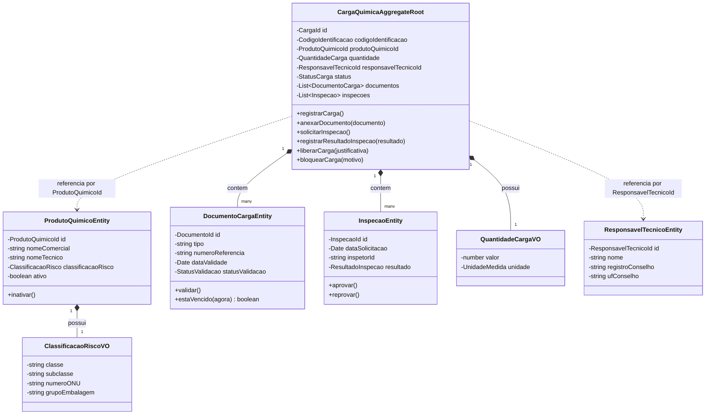
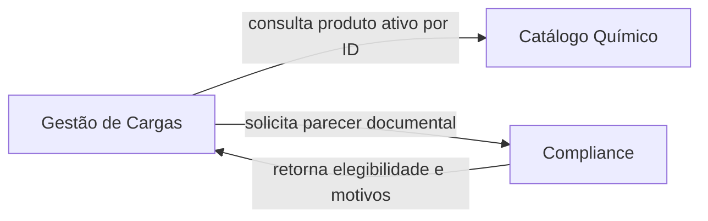

# 🧩 2. Modelagem com Domain-Driven Design (DDD)

---

## 2.1 Diagrama de Agregados e Entidades

2.2 Entidades de Domínio
    1. CargaQuimica (Aggregate Root)
        Responsabilidade: Gerenciar o ciclo de vida da carga no terminal portuário, garantir que a movimentação só ocorra se a carga estiver em conformidade e proteger as transições de status.

        Identidade: CargaId (UUID v4 imutável).

        Principais Atributos: id, codigoIdentificacao, produtoQuimicoId, quantidade, responsavelTecnicoId, documentos (lista), inspecoes (lista), status, historicoStatus (lista), dataCriacao.

        Regras Principais: Não transita para LIBERADA sem documentação completa e inspeção aprovada; não aceita alterações se estiver nos estados       CANCELADA ou FINALIZADA.

        Relacionamentos: Contém uma lista interna da Entidade DocumentoCarga e da Entidade Inspecao; referencia ProdutoQuimico pelo seu     ProdutoQuimicoId.

    2. ProdutoQuimico
        Responsabilidade: Definir o catálogo de substâncias autorizadas para movimentação no terminal e suas propriedades operacionais de risco.

        Identidade: ProdutoQuimicoId (UUID v4 imutável).

        Principais Atributos: id, nomeComercial, nomeTecnico, classificacaoRisco, ativo, dataCadastro.

        Regras Principais: Não pode ser cadastrado sem nome ou classificação de risco; quando inativado, impede o registro de novas cargas  associadas.

        Relacionamentos: Mantém um identificador consultado pelo agregado CargaQuimica.

    3. DocumentoCarga
        Responsabilidade: Representar um documento legal anexado à carga (ex.: FDS, Declaração IMDG) e rastrear seu status de validação.

        Identidade: DocumentoId (UUID v4 imutável, no escopo da Carga).

        Principais Atributos: id, tipoDocumento, numeroReferencia, urlArquivo, dataEmissao, dataValidade, statusValidacao (`PENDENTE`, `VALIDADO`, `REJEITADO`).

        Regras Principais: `EXPIRADO` não é um status persistido. O método puro `estaVencido(agora)` calcula `dataValidade < agora`; um documento vencido é inelegível para liberação mesmo que esteja `VALIDADO`.

    4. Inspecao
        Responsabilidade: Armazenar o parecer, a data, o inspetor e o resultado da vistoria física realizada no pátio portuário.

        Identidade: InspecaoId (UUID v4 imutável, no escopo da Carga).

        Principais Atributos: id, dataSolicitacao, dataRealizacao, inspetorId, resultado (PENDENTE, APROVADO, REPROVADO), observacoes.

        Regras Principais: Uma inspeção reprovada exige justificativa e dispara automaticamente o bloqueio da carga.

2.3 Objetos de Valor (Value Objects)
    1. ClassificacaoRisco
        Atributos: classe (ex.: "8 - Corrosivos"), subclasse (ex.: "8.1"), numeroONU (ex.: "1830"), grupoEmbalagem (ex.: "PG II").

        Invariantes: O numeroONU deve conter exatamente 4 dígitos numéricos. A classe deve pertencer às categorias oficiais da ANTT (1 a 9).

    2. QuantidadeCarga
        Atributos: valor (number), unidade (Enum: TONELADAS, QUILOGRAMAS, LITROS, METROS_CUBICOS).

        Invariantes: O valor deve ser estritamente maior que zero (valor > 0).

    3. CodigoIdentificacao
        Atributos: codigo (string).

        Invariantes: Formato alfanumérico com tamanho entre 8 e 20 caracteres sem espaços ou caracteres especiais.

2.4 Agregados e Invariantes
    Agregado Principal: CargaQuimica
    Aggregate Root: CargaQuimica

    Invariantes Protegidas pelo Agregado:

    Consistência Documental para Liberação: A carga jamais transita para LIBERADA se existir documento obrigatório ausente, pendente, rejeitado ou vencido no instante da decisão.

    Exigência de Inspeção Finalizada: A carga não pode ser liberada sem ter ao menos uma inspeção registrada com resultado APROVADO.

    Imutabilidade de Cargas Finalizadas/Canceladas: Cargas que atingem os estados CANCELADA ou FINALIZADA não podem aceitar inclusão de documentos,     alterações de responsáveis ou novas transições de status.

    Coerência de Responsabilidade Técnica: Nenhuma carga é transicionada para REGISTRADA ou etapas subsequentes sem um `ResponsavelTecnicoId` associado e válido.

    Limites do Agregado e Decisão Arquitetural:
    As entidades ProdutoQuimico e ResponsavelTecnico NÃO fazem parte do agregado CargaQuimica. O agregado mantém apenas referências por identificador. Isso evita um agregado gigante e reduz o acoplamento.

## 2.5 Bounded Contexts e Relacionamentos

Cada Bounded Context possui linguagem, modelo e serviços de aplicação próprios; a integração ocorre por contratos explícitos, sem acesso direto às tabelas ou entidades internas de outro contexto.

| Bounded Context | Responsabilidade | Modelo principal | Contrato oferecido |
| :--- | :--- | :--- | :--- |
| **Gestão de Cargas** | Registro, ciclo de vida, inspeção, bloqueio e liberação | `CargaQuimica`, `Inspecao`, `QuantidadeCarga` | Casos de uso de registro, inspeção e transição de estado |
| **Catálogo Químico** | Cadastro, classificação de risco e ativação de produtos | `ProdutoQuimico`, `ClassificacaoRisco` | Consulta de produto ativo por `ProdutoQuimicoId` |
| **Compliance** | Documentos obrigatórios, validade, responsabilidade técnica e parecer de conformidade | `DocumentoCarga`, `ResponsavelTecnico`, checklist documental | Parecer de elegibilidade documental por carga |

Gestão de Cargas é o contexto consumidor (*downstream*). Catálogo Químico e Compliance são fornecedores (*upstream*) por interfaces definidas na camada de aplicação.
