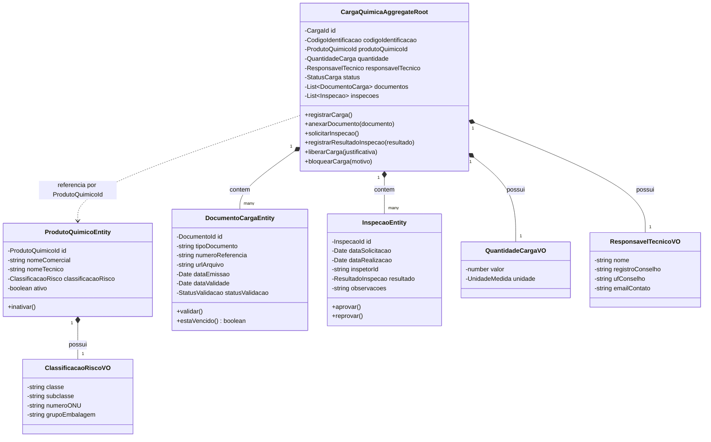
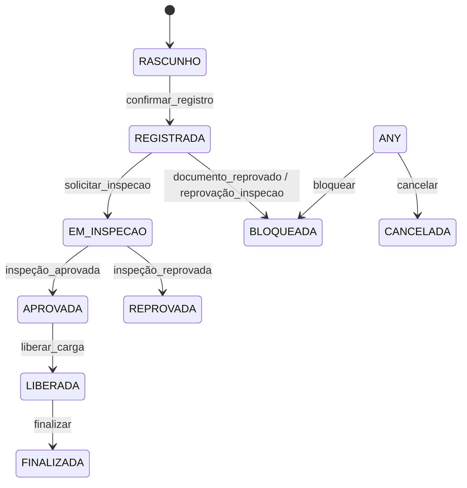

# 🧩 2. Modelagem com Domain-Driven Design (DDD)

---

Sumário (TOC)
- [2.1 Diagrama de Agregados e Entidades](#21-diagrama-de-agregados-e-entidades)
- [2.2 Entidades de Domínio](#22-entidades-de-dominio)
- [2.3 Objetos de Valor (Value Objects) — definições e invariantes](#23-objetos-de-valor-value-objects---definicoes-e-invariantes)
- [2.4 Agregados e Invariantes (Regras de Consistência)](#24-agregados-e-invariantes-regras-de-consistencia)
- [2.5 Enums e Valores Permitidos](#25-enums-e-valores-permitidos)
- [2.6 Exemplos de Implementação (TypeScript)](#26-exemplos-de-implementacao-typescript)
- [2.7 Testes e Validação (recomendações)](#27-testes-e-validacao-recomendacoes)
- [2.8 Notas Arquiteturais e ADR (proposta)](#28-notas-arquiteturais-e-adr-proposta)
- [2.9 Referências e Glossário](#29-referencias-e-glossario)

---

## 2.1 Diagrama de Agregados e Entidades

Classe e relações principais (Mermaid):


Observação: nesta modelagem `ProdutoQuimico` permanece fora do agregado `CargaQuimica` (referenciado por id). Veja [2.8 Notas Arquiteturais] para justificativa.

---

## 2.2 Entidades de Domínio

1. CargaQuimica (Aggregate Root)  
   - Responsabilidade: Gerenciar o ciclo de vida da carga no terminal, assegurar invariantes e transições de status apenas quando regras forem atendidas.  
   - Identidade: `CargaId` (UUID v4 imutável).  
   - Atributos principais: `id`, `codigoIdentificacao`, `produtoQuimicoId`, `quantidade`, `responsavelTecnico`, `documentos[]`, `inspecoes[]`, `status`, `historicoStatus[]`, `dataCriacao`.  
   - Regras principais: 
     - Não transita para `LIBERADA` sem documentação completa (`VALIDADO`) e pelo menos uma inspeção com resultado `APROVADO`.
     - Não aceita alterações quando em estados `CANCELADA` ou `FINALIZADA`.  
   - Relacionamentos: Contém `DocumentoCarga` e `Inspecao`; referencia `ProdutoQuimico` por `produtoQuimicoId`.

2. ProdutoQuimico  
   - Responsabilidade: Catálogo de substâncias com classificação de risco.  
   - Identidade: `ProdutoQuimicoId` (UUID v4).  
   - Atributos: `id`, `nomeComercial`, `nomeTecnico`, `classificacaoRisco`, `ativo`, `dataCadastro`.  
   - Regras: Não pode ser cadastrado sem nome e classificação de risco; quando `ativo === false` impede registro de novas cargas associadas.  
   - Nota: mantido como agregado separado (referência por id).

3. DocumentoCarga  
   - Responsabilidade: Representar documento legal (FDS, Laudo, Declaração IMDG) e controlar validade/validação.  
   - Identidade: `DocumentoId` (UUID v4, escopo de Carga).  
   - Atributos: `id`, `tipoDocumento`, `numeroReferencia`, `urlArquivo`, `dataEmissao`, `dataValidade`, `statusValidacao` (`PENDENTE|VALIDADO|REJEITADO`).  
   - Regras: Se `dataValidade < hoje` → `estaVencido() === true` e impede liberação.

4. Inspecao  
   - Responsabilidade: Parecer de vistoria física.  
   - Identidade: `InspecaoId` (UUID v4, escopo de Carga).  
   - Atributos: `id`, `dataSolicitacao`, `dataRealizacao`, `inspetorId`, `resultado` (`PENDENTE|APROVADO|REPROVADO`), `observacoes`.  
   - Regras: `REPROVADO` exige justificativa e deve disparar bloqueio da carga.

---

## 2.3 Objetos de Valor (Value Objects) — definições e invariantes

1. ClassificacaoRisco  
   - Atributos: `classe` (ex.: "8 - Corrosivos"), `subclasse` (ex.: "8.1"), `numeroONU`, `grupoEmbalagem`.  
   - Invariantes: `numeroONU` deve ter exatamente 4 dígitos. Regex: `^\d{4}$`.

2. QuantidadeCarga  
   - Atributos: `valor: number`, `unidade: UnidadeMedida`.  
   - Invariante: `valor > 0`.

3. ResponsavelTecnico  
   - Atributos: `nome`, `registroConselho`, `ufConselho`, `emailContato`.  
   - Invariantes:
     - `registroConselho` não vazio e segue o padrão: `^(?i)(CRQ|CREA)[\s-]?\d{3,7}$` (case-insensitive).  
       - Se sua ferramenta não aceita `(?i)`, use `^(CRQ|CREA)[\s-]?\d{3,7}$` e valide uppercase.  
     - `ufConselho` deve estar entre as UFs válidas: regex:  
       `^(?:AC|AL|AP|AM|BA|CE|DF|ES|GO|MA|MT|MS|MG|PA|PB|PR|PE|PI|RJ|RN|RS|RO|RR|SC|SP|SE|TO)$`

4. CodigoIdentificacao  
   - Atributo: `codigo` (string).  
   - Invariante: alfanumérico 8–20 chars, sem espaços/acentos: `^[A-Za-z0-9]{8,20}$`.

Observação geral: implemente validação no construtor do VO para garantir invariantes imutáveis.

---

## 2.4 Agregados e Invariantes (Regras de Consistência)

Agregado principal: `CargaQuimica` (Aggregate Root).

Invariantes essenciais protegidas pelo agregado:
- Consistência Documental para Liberação: A carga não pode ir para `LIBERADA` se existir qualquer documento obrigatório com `statusValidacao` diferente de `VALIDADO` ou com `estaVencido() === true`.
- Exigência de Inspeção Aprovada: Deve haver ao menos uma `Inspecao` com `resultado === APROVADO`.
- Imutabilidade de Cargas Finalizadas/Canceladas: Estados `CANCELADA` ou `FINALIZADA` tornam a carga imutável (ex.: `anexarDocumento`, `alterarResponsavel` devem falhar).
- Coerência de Responsabilidade Técnica: Nenhuma carga é registrada sem `responsavelTecnico` válido.
- Escopo do Agregado: `ProdutoQuimico` é referenciado por `produtoQuimicoId` (evita agregado grande e acoplamento).

Diagrama de estados (Mermaid):



Observação: `ANY` representa transições possíveis de vários estados mediante eventos operacionais (ex.: emergência).

---

## 2.5 Enums e Valores Permitidos

Sugestões (usar em TypeScript/DB/models):
- StatusCarga = { RASCUNHO, REGISTRADA, EM_ANALISE, EM_INSPECAO, APROVADA, LIBERADA, BLOQUEADA, CANCELADA, FINALIZADA }
- StatusValidacao = { PENDENTE, VALIDADO, REJEITADO }
- ResultadoInspecao = { PENDENTE, APROVADO, REPROVADO }
- UnidadeMedida = { TONELADAS, QUILOGRAMAS, LITROS, METROS_CUBICOS }

Documente esses enums de forma centralizada no repositório (ex.: src/domain/enums.ts) para evitar divergência.

---

## 2.6 Exemplos de Implementação (TypeScript)

Exemplos concisos de Value Objects e Aggregate Root. Estes são guias; ajuste para seu estilo de domínio/infra.

Arquivo de enums (exemplo):
```typescript
// name: src/domain/enums.ts
export enum StatusCarga { RASCUNHO = 'RASCUNHO', REGISTRADA = 'REGISTRADA', LIBERADA = 'LIBERADA', BLOQUEADA = 'BLOQUEADA', CANCELADA = 'CANCELADA', FINALIZADA = 'FINALIZADA' }
export enum StatusValidacao { PENDENTE = 'PENDENTE', VALIDADO = 'VALIDADO', REJEITADO = 'REJEITADO' }
export enum ResultadoInspecao { PENDENTE = 'PENDENTE', APROVADO = 'APROVADO', REPROVADO = 'REPROVADO' }
export enum UnidadeMedida { TONELADAS = 'TONELADAS', QUILOGRAMAS = 'QUILOGRAMAS', LITROS = 'LITROS', METROS_CUBICOS = 'METROS_CUBICOS' }
```

Value Object: CodigoIdentificacao
```typescript
// name: src/domain/value-objects/CodigoIdentificacao.ts
export class CodigoIdentificacao {
  public readonly codigo: string;
  private static readonly regex = /^[A-Za-z0-9]{8,20}$/;

  constructor(codigo: string) {
    if (!CodigoIdentificacao.regex.test(codigo)) {
      throw new Error('CodigoIdentificacao inválido: deve conter 8-20 caracteres alfanuméricos sem espaços.');
    }
    this.codigo = codigo;
  }
}
```

Value Object: ResponsavelTecnico
```typescript
// name: src/domain/value-objects/ResponsavelTecnico.ts
export class ResponsavelTecnico {
  public readonly nome: string;
  public readonly registroConselho: string;
  public readonly ufConselho: string;
  public readonly emailContato?: string;

  private static readonly registroRegex = /^(?i)(CRQ|CREA)[\s-]?\d{3,7}$/;
  private static readonly ufRegex = /^(?:AC|AL|AP|AM|BA|CE|DF|ES|GO|MA|MT|MS|MG|PA|PB|PR|PE|PI|RJ|RN|RS|RO|RR|SC|SP|SE|TO)$/;

  constructor(nome: string, registroConselho: string, ufConselho: string, emailContato?: string) {
    if (!nome || nome.trim().length === 0) throw new Error('Nome do responsável técnico é obrigatório.');
    if (!new RegExp(ResponsavelTecnico.registroRegex).test(registroConselho)) throw new Error('Registro do conselho inválido.');
    if (!ResponsavelTecnico.ufRegex.test(ufConselho)) throw new Error('UF inválida.');
    this.nome = nome;
    this.registroConselho = registroConselho;
    this.ufConselho = ufConselho;
    this.emailContato = emailContato;
  }
}
```

Aggregate root (esqueleto simplificado):
```typescript
// name: src/domain/aggregates/CargaQuimica.ts
import { StatusCarga, StatusValidacao, ResultadoInspecao } from '../enums';
import { CodigoIdentificacao } from '../value-objects/CodigoIdentificacao';
import { ResponsavelTecnico } from '../value-objects/ResponsavelTecnico';
import { QuantidadeCarga } from '../value-objects/QuantidadeCarga';

export class CargaQuimica {
  readonly id: string;
  codigoIdentificacao: CodigoIdentificacao;
  produtoQuimicoId: string;
  quantidade: QuantidadeCarga;
  responsavelTecnico?: ResponsavelTecnico;
  status: StatusCarga;
  documentos: any[] = [];
  inspecoes: any[] = [];
  // historicoStatus, dataCriacao, etc.

  constructor(props: {
    id: string;
    codigoIdentificacao: CodigoIdentificacao;
    produtoQuimicoId: string;
    quantidade: QuantidadeCarga;
    responsavelTecnico?: ResponsavelTecnico;
  }) {
    this.id = props.id;
    this.codigoIdentificacao = props.codigoIdentificacao;
    this.produtoQuimicoId = props.produtoQuimicoId;
    this.quantidade = props.quantidade;
    this.responsavelTecnico = props.responsavelTecnico;
    this.status = StatusCarga.RASCUNHO;
  }

  anexarDocumento(doc: { id: string; tipoDocumento: string; dataValidade?: string; statusValidacao?: StatusValidacao }) {
    if ([StatusCarga.CANCELADA, StatusCarga.FINALIZADA].includes(this.status)) {
      throw new Error('Carga imutável em estado CANCELADA ou FINALIZADA.');
    }
    this.documentos.push(doc);
  }

  podeLiberar(): { ok: boolean; motivos: string[] } {
    const motivos: string[] = [];
    // Documentos obrigatórios: exemplo checagem simplificada
    const docsInvalidos = this.documentos.filter(d => d.statusValidacao !== StatusValidacao.VALIDADO || (d.dataValidade && new Date(d.dataValidade) < new Date()));
    if (docsInvalidos.length > 0) motivos.push('Documentação incompleta ou vencida.');
    const temInspecaoAprovada = this.inspecoes.some(i => i.resultado === ResultadoInspecao.APROVADO);
    if (!temInspecaoAprovada) motivos.push('Nenhuma inspeção aprovada.');
    return { ok: motivos.length === 0, motivos };
  }

  liberarCarga(justificativa: string) {
    const check = this.podeLiberar();
    if (!check.ok) throw new Error(`Impossível liberar: ${check.motivos.join('; ')}`);
    this.status = StatusCarga.LIBERADA;
    // publicar evento CargaLiberada
  }

  // outros métodos: bloquearCarga, registrarResultadoInspecao, etc.
}
```

Repositório e carregamento eventual: carregar `ProdutoQuimico` por `produtoQuimicoId` via `ProdutoQuimicoRepository` (consulta read-model) apenas quando necessário para validações que dependam do produto.

---

## 2.7 Testes e Validação (recomendações)

Recomenda-se cobertura de testes unitários e alguns testes de integração para invariantes:

Testes unitários sugeridos:
- VO:
  - CodigoIdentificacao: aceita formatos válidos e rejeita inválidos.
  - ResponsavelTecnico: aceita CRQ/CREA válidos (ex.: "CRQ 12345") e rejeita UFs invalidas.
  - ClassificacaoRisco.numeroONU: aceita 4 dígitos apenas.
- Aggregate invariants:
  - Tentativa de liberar carga sem documentos válidos → erro.
  - Tentativa de liberar carga sem inspeção aprovada → erro.
  - Anexar documento em carga `CANCELADA` → erro.
  - Após inspeção `REPROVADO` → carga fica `BLOQUEADA`.
- Fluxos happy-path:
  - Registrar carga -> anexar documentos válidos -> registrar inspeção aprovada -> liberarCarga() atualiza status para `LIBERADA`.

Testes de integração:
- Simular leitura de `ProdutoQuimico` inativo que impede novo registro de carga.
- Mock de repositório e verificação de publicação de eventos (event sourcing ou mensagens).

Ferramentas sugeridas:
- Jest para unit tests em TypeScript.
- Sinon / jest mocks para repositórios e adaptadores externos.
- Validadores (zod, class-validator) podem facilitar checagens nos DTOs/ports.

---

## 2.8 Notas Arquiteturais e ADR (proposta)

Decisão proposta: `ProdutoQuimico` fora do agregado `CargaQuimica` (referenciado por `produtoQuimicoId`). Racional (SUGESTÃO — confirmar com o time / autor):
- ProdutoQuimico é um catálogo com vida própria e atualizações independentes (nome, classificação), possivelmente compartilhado por múltiplos contextos e processos. Incluir este objeto dentro de `CargaQuimica` tornaria o agregado grande e sujeito a contenção e acoplamento.
- Vantagens de mantê-lo fora:
  - Agregado `CargaQuimica` permanece pequeno e focado nas invariantes da operação da carga.
  - Possibilidade de atualizar `ProdutoQuimico` independentemente, com estratégias de eventual consistency para propagar mudanças a visualizações/leitura.
  - Melhor performance em operações concorrentes sobre cargas.
- Quando considerar mover para dentro:
  - Se `ProdutoQuimico` for imutável e intrinsecamente parte do ciclo de vida da carga (mudanças ao produto exigem transação com a carga), incluir pode ser justificável.

Ação sugerida: criar um ADR formal em `docs/adr/` com esta proposta e aprová-lo no PR.

---

## 2.9 Referências e Glossário

- Glossário canônico do projeto: [docs/1_dominio.md](/gabrixlzdev/QuimiPort/blob/issue-6/docs/1_dominio.md) — usar como referência principal para termos ubiquos.
- Recomendações:
  - Centralizar enums em `src/domain/enums.ts`.
  - Centralizar regex/validações em VOs e utilizá-los em DTOs/adapters.
  - Documentar ADRs em `docs/adr/`.

---

Notas finais
- As convenções de nome escolhidas: Portuguese prose; ASCII-only identifiers; PascalCase para entidades; camelCase para campos; ENUMS em maiúsculas.  
- Regex principais recap:
  - numeroONU: `^\d{4}$`  
  - codigoIdentificacao: `^[A-Za-z0-9]{8,20}$`  
  - registroConselho (preferido, case-insensitive): `^(?i)(CRQ|CREA)[\s-]?\d{3,7}$`  (alternativa sem `(?i)` para sua ferramenta: `^(CRQ|CREA)[\s-]?\d{3,7}$`)  
  - ufConselho (UFs BR): `^(?:AC|AL|AP|AM|BA|CE|DF|ES|GO|MA|MT|MS|MG|PA|PB|PR|PE|PI|RJ|RN|RS|RO|RR|SC|SP|SE|TO)$`

Se quiser, eu adapto esse conteúdo para seu estilo (ex.: mais/menos detalhes), gero os arquivos TypeScript reais (VOs/enums/aggregate skeleton) ou preparo um patch pronto para commit na branch `issue-6`. Quer que eu gere também os arquivos TS de exemplo aqui (em seguida), ou prefere revisar este documento primeiro?
