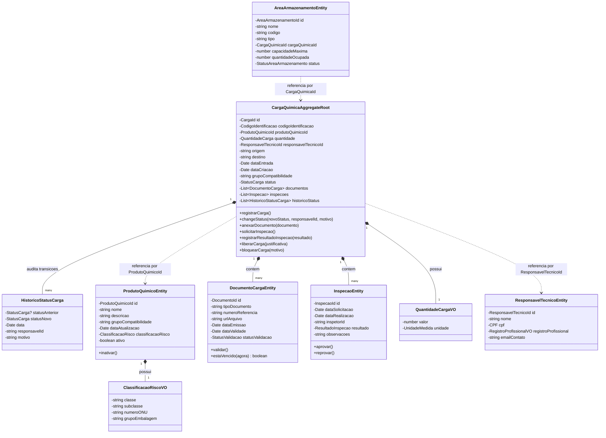
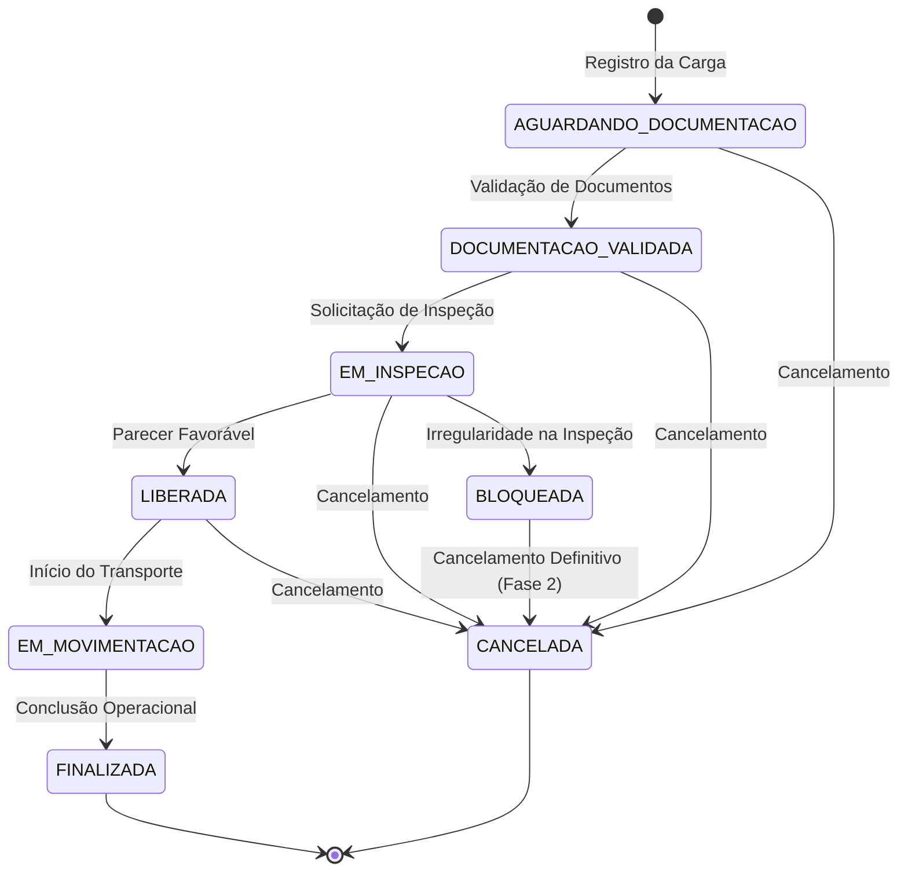
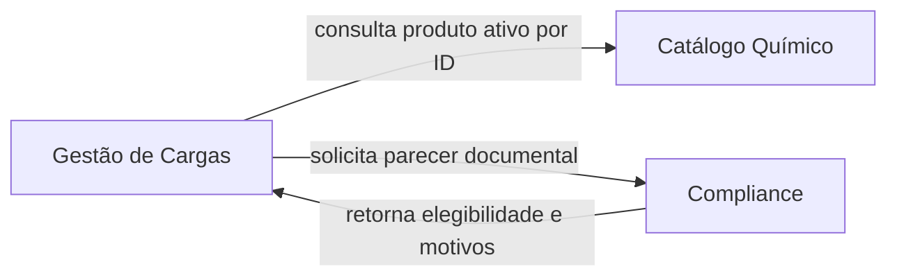

# 🧩 2. Modelagem com Domain-Driven Design (DDD)

---

Sumário (TOC)
- [2.1 Diagrama de Agregados e Entidades](#21-diagrama-de-agregados-e-entidades)
- [2.2 Entidades de Domínio](#22-entidades-de-dominio)
- [2.3 Objetos de Valor (Value Objects) — definições e invariantes](#23-objetos-de-valor-value-objects---definicoes-e-invariantes)
- [2.4 Agregados e Invariantes (Regras de Consistência)](#24-agregados-e-invariantes-regras-de-consistencia)
- [2.5 Enums e Valores Permitidos](#25-enums-e-valores-permitidos)
- [2.6 Exemplos de Implementação (TypeScript)](#26-exemplos-de-implementacao-typescript)
- [2.7 Testes e Validação (recomendações)](#27-testes-e-validacao-recomendacoes)
- [2.8 Notas Arquiteturais e ADR (proposta)](#28-notas-arquiteturais-e-adr-proposta)

---

## 2.1 Diagrama de Agregados e Entidades

Classe e relações principais (Mermaid):


```mermaid
classDiagram
    class CargaQuimicaAggregateRoot {
        -CargaId id
        -CodigoIdentificacao codigoIdentificacao
        -ProdutoQuimicoId produtoQuimicoId
        -QuantidadeCarga quantidade
        -ResponsavelTecnicoId responsavelTecnicoId
        -string origem
        -string destino
        -Date dataEntrada
        -Date dataCriacao
        -string grupoCompatibilidade
        -StatusCarga status
        -List~DocumentoCarga~ documentos
        -List~Inspecao~ inspecoes
        -List~HistoricoStatusCarga~ historicoStatus
        +registrarCarga()
        +changeStatus(novoStatus, responsavelId, motivo)
        +anexarDocumento(documento)
        +solicitarInspecao()
        +registrarResultadoInspecao(resultado)
        +liberarCarga(justificativa)
        +bloquearCarga(motivo)
    }

    class HistoricoStatusCarga {
        -StatusCarga? statusAnterior
        -StatusCarga statusNovo
        -Date data
        -string responsavelId
        -string motivo
    }

    class ProdutoQuimicoEntity {
        -ProdutoQuimicoId id
        -string nome
        -string descricao
        -string grupoCompatibilidade
        -Date dataAtualizacao
        -ClassificacaoRisco classificacaoRisco
        -boolean ativo
        +inativar()
    }

    class DocumentoCargaEntity {
        -DocumentoId id
        -string tipoDocumento
        -string numeroReferencia
        -string urlArquivo
        -Date dataEmissao
        -Date dataValidade
        -StatusValidacao statusValidacao
        +validar()
        +estaVencido(agora) boolean
    }

    class InspecaoEntity {
        -InspecaoId id
        -Date dataSolicitacao
        -Date dataRealizacao
        -string inspetorId
        -ResultadoInspecao resultado
        -string observacoes
        +aprovar()
        +reprovar()
    }

    class ClassificacaoRiscoVO {
        -string classe
        -string subclasse
        -string numeroONU
        -string grupoEmbalagem
    }

    class QuantidadeCargaVO {
        -number valor
        -UnidadeMedida unidade
    }

    class ResponsavelTecnicoEntity {
        -ResponsavelTecnicoId id
        -string nome
        -CPF cpf
        -RegistroProfissionalVO registroProfissional
        -string emailContato
    }

    class AreaArmazenamentoEntity {
        -AreaArmazenamentoId id
        -string nome
        -string codigo
        -string tipo
        -CargaQuimicaId cargaQuimicaId
        -number capacidadeMaxima
        -number quantidadeOcupada
        -StatusAreaArmazenamento status
    }

    CargaQuimicaAggregateRoot "1" *-- "many" DocumentoCargaEntity : contem
    CargaQuimicaAggregateRoot "1" *-- "many" InspecaoEntity : contem
    CargaQuimicaAggregateRoot "1" *-- "many" HistoricoStatusCarga : audita transicoes
    CargaQuimicaAggregateRoot "1" *-- "1" QuantidadeCargaVO : possui
    CargaQuimicaAggregateRoot ..> ResponsavelTecnicoEntity : referencia por ResponsavelTecnicoId
    CargaQuimicaAggregateRoot ..> ProdutoQuimicoEntity : referencia por ProdutoQuimicoId
    ProdutoQuimicoEntity "1" *-- "1" ClassificacaoRiscoVO : possui
    AreaArmazenamentoEntity ..> CargaQuimicaAggregateRoot : referencia por CargaQuimicaId
```
Observação: nesta modelagem `ProdutoQuimico` permanece fora do agregado `CargaQuimica` (referenciado por id). Veja [2.8 Notas Arquiteturais] para justificativa.

---

## 2.2 Entidades de Domínio

1. CargaQuimica (Aggregate Root)  
   - Responsabilidade: Gerenciar o ciclo de vida da carga no terminal, assegurar invariantes e transições de status apenas quando regras forem atendidas.  
   - Identidade: `CargaId` (UUID v4 imutável).  
   - Atributos principais: `id`, `codigoIdentificacao`, `produtoQuimicoId`, `quantidade`, `responsavelTecnicoId`, `origem`, `destino`, `dataEntrada`, `grupoCompatibilidade`, `documentos[]`, `inspecoes[]`, `status`, `historicoStatus[]`, `dataCriacao`.
   - `historicoStatus[]` é uma trilha append-only. A carga inicia com um evento (`statusAnterior: null`, status inicial, data de criação, responsável técnico e motivo `Carga criada.`); cada transição válida acrescenta status anterior/novo, data, responsável e motivo obrigatório. A reidratação valida a continuidade da trilha e sua concordância com o status atual.
   - Regras principais: 
     - Não transita para `LIBERADA` sem documentação completa (`VALIDADO`) e pelo menos uma inspeção com resultado `APROVADO`.
     - Não aceita alterações quando em estados `CANCELADA` ou `FINALIZADA`.
     - A origem, o destino e a data de entrada devem ser registrados no momento do cadastro da carga e mantidos para rastreabilidade operacional.
   - Relacionamentos: Contém `DocumentoCarga` e `Inspecao`; referencia `ProdutoQuimico` por `produtoQuimicoId`.

2. ProdutoQuimico  
   - Responsabilidade: Catálogo de substâncias com classificação de risco.  
   - Identidade: `ProdutoQuimicoId` (UUID v4).  
   - Atributos: `id`, `nome`, `descricao`, `grupoCompatibilidade`, `classificacaoRisco`, `ativo`, `dataCadastro`, `dataAtualizacao`.  
   - Regras: Não pode ser cadastrado sem nome, descrição e classificação de risco; quando `ativo === false` impede registro de novas cargas associadas. O campo `grupoCompatibilidade` identifica a família compatível do produto, e `dataAtualizacao` registra a última alteração cadastral.  
   - Nota: mantido como agregado separado (referência por id).

3. DocumentoCarga  
   - Responsabilidade: Representar documento legal (FDS, Laudo, Declaração IMDG) e controlar validade/validação.  
   - Identidade: `DocumentoId` (UUID v4, escopo de Carga).  
   - Atributos: `id`, `tipoDocumento`, `numeroReferencia`, `urlArquivo`, `dataEmissao`, `dataValidade`, `statusValidacao` (`PENDENTE|VALIDADO|REJEITADO`).  
   - Regras: Se `dataValidade < hoje` → `estaVencido() === true` e impede liberação.

4. Inspecao  
   - Responsabilidade: Parecer de vistoria física.  
   - Identidade: `InspecaoId` (UUID v4, escopo de Carga).  
   - Atributos: `id`, `dataSolicitacao`, `dataRealizacao`, `inspetorId`, `resultado` (`PENDENTE|APROVADO|REPROVADO`), `observacoes`.  
   - Regras: `REPROVADO` exige justificativa e deve disparar bloqueio da carga.

5. ResponsavelTecnico  
   - Responsabilidade: Representar o profissional legalmente habilitado que responde tecnicamente pela carga química perante os órgãos reguladores.  
   - Identidade: `ResponsavelTecnicoId` (UUID v4).  
   - Atributos: `id`, `nome`, `cpf`, `registroProfissional` (CRQ/CREA + UF), `emailContato` (opcional).  
   - Regras: RN-RTC-02 — não pode ser cadastrado sem `cpf` válido (dígitos verificadores conferidos pelo VO `CPF`); RN-RTC-03 — não pode ser cadastrado sem `registroProfissional` válido (VO `RegistroProfissional`).  
   - Relacionamentos: Referenciado por `CargaQuimica` através de `responsavelTecnicoId`; não faz parte do agregado (ver 2.8).

6. AreaArmazenamento  
   - Responsabilidade: Representar o espaço físico do pátio/armazém onde uma carga química fica alocada, controlando ocupação e capacidade.  
   - Identidade: `AreaArmazenamentoId` (UUID v4).  
   - Atributos: `id`, `nome`, `codigo`, `tipo` (`PATIO|ARMAZEM|AREA_SEGURA`), `cargaQuimicaId`, `capacidadeMaxima`, `quantidadeOcupada`, `status` (`COM_ESPACO|LOTADA`).  
   - Regras: RN-ARM-02 — status inicial sempre `COM_ESPACO`; RN-ARM-03 — não pode existir sem `cargaQuimicaId` associado; RN-ARM-04 — `quantidadeOcupada` deve ser maior que zero; RN-ARM-05 — `quantidadeOcupada` nunca pode exceder `capacidadeMaxima`.  
   - Relacionamentos: Referencia `CargaQuimica` por `cargaQuimicaId`; não faz parte do agregado `CargaQuimica` pelo mesmo motivo de `ProdutoQuimico` (ver 2.8).

---

## 2.3 Objetos de Valor (Value Objects) — definições e invariantes

1. ClassificacaoRisco  
   - Atributos: `classe` (ex.: "8 - Corrosivos"), `subclasse` (ex.: "8.1"), `numeroONU`, `grupoEmbalagem`.  
   - Invariantes: `numeroONU` deve ter exatamente 4 dígitos. Regex: `^\d{4}$`.

2. QuantidadeCarga  
   - Atributos: `valor: number`, `unidade: UnidadeMedida`.  
   - Invariante: `valor > 0`.

3. RegistroProfissional  
   - Atributos: `valor` (ex.: "CRQ 12345"), `ufConselho`.  
   - Invariantes:
     - `valor` não vazio e segue o padrão: `^(CRQ|CREA)[\s-]?\d{3,7}$` (case-insensitive).  
     - `ufConselho` deve estar entre as UFs válidas: regex:  
       `^(?:AC|AL|AP|AM|BA|CE|DF|ES|GO|MA|MT|MS|MG|PA|PB|PR|PE|PI|RJ|RN|RS|RO|RR|SC|SP|SE|TO)$`

4. CPF  
   - Atributo: `valor` (string, 11 dígitos sem máscara).  
   - Invariantes:
     - Deve conter exatamente 11 dígitos e não pode ser uma sequência de dígitos repetidos (ex.: `00000000000`).
     - Os dois dígitos verificadores devem ser válidos segundo o algoritmo oficial (módulo 11), não apenas a quantidade de dígitos.

5. CodigoIdentificacao  
   - Atributo: `codigo` (string).  
   - Invariante: alfanumérico 8–20 chars, sem espaços/acentos: `^[A-Za-z0-9]{8,20}$`.

Observação geral: implemente validação no construtor do VO para garantir invariantes imutáveis.

---

## 2.4 Agregados e Invariantes (Regras de Consistência)

Agregado principal: `CargaQuimica` (Aggregate Root).

Invariantes essenciais protegidas pelo agregado:
- Consistência Documental para Liberação: A carga não pode ir para `LIBERADA` se existir qualquer documento obrigatório com `statusValidacao` diferente de `VALIDADO` ou com `estaVencido() === true`.
- Exigência de Inspeção Aprovada: Deve haver ao menos uma `Inspecao` com `resultado === APROVADO`.
- Imutabilidade de Cargas Finalizadas/Canceladas: Estados `CANCELADA` ou `FINALIZADA` tornam a carga imutável (ex.: `anexarDocumento`, `alterarResponsavel` devem falhar).
- Coerência de Responsabilidade Técnica: Nenhuma carga é registrada sem `responsavelTecnico` válido.
- Escopo do Agregado: `ProdutoQuimico` é referenciado por `produtoQuimicoId` (evita agregado grande e acoplamento).

Diagrama de estados (Mermaid):


```mermaid
stateDiagram-v2
    [*] --> AGUARDANDO_DOCUMENTACAO: Registro da Carga

    AGUARDANDO_DOCUMENTACAO --> DOCUMENTACAO_VALIDADA: Validação de Documentos
    AGUARDANDO_DOCUMENTACAO --> CANCELADA: Cancelamento

    DOCUMENTACAO_VALIDADA --> EM_INSPECAO: Solicitação de Inspeção
    DOCUMENTACAO_VALIDADA --> CANCELADA: Cancelamento

    EM_INSPECAO --> LIBERADA: Parecer Favorável
    EM_INSPECAO --> CANCELADA: Cancelamento
    EM_INSPECAO --> BLOQUEADA: Irregularidade na Inspeção

    LIBERADA --> EM_MOVIMENTACAO: Início do Transporte
    LIBERADA --> CANCELADA: Cancelamento

    EM_MOVIMENTACAO --> FINALIZADA: Conclusão Operacional

    BLOQUEADA --> CANCELADA: Cancelamento Definitivo (Fase 2)

    FINALIZADA --> [*]
    CANCELADA --> [*]
```

Observação: qualquer transição fora desses 11 caminhos deve ser rejeitada pela máquina de estados de domínio, e estados finais não aceitam alterações posteriores. `BLOQUEADA` só é alcançável a partir de `EM_INSPECAO`, em conformidade estrita com o fluxo definido no enunciado da Fase 2.

---

## 2.5 Enums e Valores Permitidos

Enum oficial do sistema QuimiPort:
- StatusCarga = { AGUARDANDO_DOCUMENTACAO, DOCUMENTACAO_VALIDADA, EM_INSPECAO, LIBERADA, EM_MOVIMENTACAO, FINALIZADA, BLOQUEADA, CANCELADA }
- StatusValidacao = { PENDENTE, VALIDADO, REJEITADO }
- ResultadoInspecao = { PENDENTE, APROVADO, REPROVADO }
- UnidadeMedida = { TONELADAS, QUILOGRAMAS, LITROS, METROS_CUBICOS }
- StatusAreaArmazenamento = { COM_ESPACO, LOTADA }

Documente esses enums de forma centralizada no repositório (ex.: src/domain/enums.ts) para evitar divergência.

---

## 2.6 Exemplos de Implementação (TypeScript)

Exemplos concisos de Value Objects e Aggregate Root. Estes são guias; ajuste para seu estilo de domínio/infra.

Arquivo de enums (exemplo):
```typescript
// name: src/domain/enums.ts
export enum StatusCarga {
  AGUARDANDO_DOCUMENTACAO = 'AGUARDANDO_DOCUMENTACAO',
  DOCUMENTACAO_VALIDADA = 'DOCUMENTACAO_VALIDADA',
  EM_INSPECAO = 'EM_INSPECAO',
  LIBERADA = 'LIBERADA',
  EM_MOVIMENTACAO = 'EM_MOVIMENTACAO',
  FINALIZADA = 'FINALIZADA',
  BLOQUEADA = 'BLOQUEADA',
  CANCELADA = 'CANCELADA'
}

export enum StatusValidacao { PENDENTE = 'PENDENTE', VALIDADO = 'VALIDADO', REJEITADO = 'REJEITADO' }
export enum ResultadoInspecao { PENDENTE = 'PENDENTE', APROVADO = 'APROVADO', REPROVADO = 'REPROVADO' }
export enum UnidadeMedida { TONELADAS = 'TONELADAS', QUILOGRAMAS = 'QUILOGRAMAS', LITROS = 'LITROS', METROS_CUBICOS = 'METROS_CUBICOS' }
```

Value Object: CodigoIdentificacao
```typescript
// name: src/domain/value-objects/CodigoIdentificacao.ts
export class CodigoIdentificacao {
  public readonly codigo: string;
  private static readonly regex = /^[A-Za-z0-9]{8,20}$/;

  constructor(codigo: string) {
    if (!CodigoIdentificacao.regex.test(codigo)) {
      throw new Error('CodigoIdentificacao inválido: deve conter 8-20 caracteres alfanuméricos sem espaços.');
    }
    this.codigo = codigo;
  }
}
```

Value Object: RegistroProfissional
```typescript
// name: src/domain/value-objects/registro-profissional.vo.ts
export class RegistroProfissional {
  public readonly valor: string;
  public readonly ufConselho: string;

  private static readonly registroRegex = /^(CRQ|CREA)[\s-]?\d{3,7}$/i;
  private static readonly ufRegex = /^(?:AC|AL|AP|AM|BA|CE|DF|ES|GO|MA|MT|MS|MG|PA|PB|PR|PE|PI|RJ|RN|RS|RO|RR|SC|SP|SE|TO)$/i;

  constructor(registro: string, ufConselho: string) {
    if (!registro || !RegistroProfissional.registroRegex.test(registro)) {
      throw new Error('Registro profissional inválido. Use CRQ/CREA com 3 a 7 dígitos.');
    }
    if (!RegistroProfissional.ufRegex.test(ufConselho)) {
      throw new Error('UF do conselho inválida.');
    }
    this.valor = registro;
    this.ufConselho = ufConselho.toUpperCase();
  }
}
```

Value Object: CPF
```typescript
// name: src/domain/value-objects/cpf.vo.ts
export class Cpf {
  public readonly valor: string;

  constructor(valor: string) {
    const digitos = (valor ?? '').replace(/\D/g, '');
    if (!Cpf.temEstruturaValida(digitos) || !Cpf.temDigitosVerificadoresValidos(digitos)) {
      throw new Error('CPF inválido.');
    }
    this.valor = digitos;
  }

  // valida estrutura (11 dígitos, não repetidos) e os 2 dígitos verificadores (módulo 11)
  private static temEstruturaValida(digitos: string): boolean { /* ... */ return true; }
  private static temDigitosVerificadoresValidos(digitos: string): boolean { /* ... */ return true; }
}
```

Entity: ResponsavelTecnico
```typescript
// name: src/domain/entities/responsavel-tecnico.entity.ts
export class ResponsavelTecnico {
  public readonly id: string;
  public readonly nome: string;
  public readonly cpf: Cpf;
  public readonly registroProfissional: RegistroProfissional;
  public readonly emailContato?: string;

  constructor(props: ResponsavelTecnicoProps) {
    if (!props.id || !props.nome || !props.cpf || !props.registroProfissional) {
      throw new Error('Responsável técnico inválido.');
    }
    // ... atribuição dos campos
  }
}
```

Entity: AreaArmazenamento
```typescript
// name: src/domain/entities/area-armazenamento.entity.ts
export class AreaArmazenamento {
  public readonly status: StatusAreaArmazenamento;
  // id, nome, codigo, tipo, cargaQuimicaId, capacidadeMaxima, quantidadeOcupada

  constructor(props: AreaArmazenamentoProps) {
    if (!props.cargaQuimicaId) throw new Error('Área de armazenamento deve estar associada a uma carga química.');
    if (!props.capacidadeMaxima || props.capacidadeMaxima <= 0) throw new Error('Capacidade máxima deve ser maior que zero.');
    if (!props.quantidadeOcupada || props.quantidadeOcupada <= 0) throw new Error('Quantidade ocupada deve ser maior que zero.');
    if (props.quantidadeOcupada > props.capacidadeMaxima) throw new Error('Quantidade ocupada não pode exceder a capacidade máxima da área.');
    // status sempre inicia como COM_ESPACO (RN-ARM-02)
    this.status = StatusAreaArmazenamento.COM_ESPACO;
  }
}
```

Aggregate root (esqueleto simplificado):
```typescript
// name: src/domain/aggregates/CargaQuimica.ts
import { StatusCarga, StatusValidacao, ResultadoInspecao } from '../enums';
import { CodigoIdentificacao } from '../value-objects/CodigoIdentificacao';
import { ResponsavelTecnico } from '../value-objects/ResponsavelTecnico';
import { QuantidadeCarga } from '../value-objects/QuantidadeCarga';

export class CargaQuimica {
  readonly id: string;
  codigoIdentificacao: CodigoIdentificacao;
  produtoQuimicoId: string;
  quantidade: QuantidadeCarga;
  responsavelTecnico?: ResponsavelTecnico;
  status: StatusCarga;
  documentos: any[] = [];
  inspecoes: any[] = [];
  readonly dataCriacao: Date;
  private readonly eventosStatus: HistoricoStatusCarga[] = [];

  get historicoStatus(): readonly HistoricoStatusCarga[] { ... }

  changeStatus(novoStatus: StatusCarga, responsavelId: string, motivo: string): void {
    // valida a transição e registra o evento antes de atualizar o status atual
  }

  constructor(produtoQuimico: {
    id: string;
    codigoIdentificacao: CodigoIdentificacao;
    produtoQuimicoId: string;
    quantidade: QuantidadeCarga;
    responsavelTecnico?: ResponsavelTecnico;
  }) {
    this.id = produtoQuimico.id;
    this.codigoIdentificacao = produtoQuimico.codigoIdentificacao;
    this.produtoQuimicoId = produtoQuimico.produtoQuimicoId;
    this.quantidade = produtoQuimico.quantidade;
    this.responsavelTecnico = produtoQuimico.responsavelTecnico;
    this.status = StatusCarga.RASCUNHO;
  }

  anexarDocumento(doc: { id: string; tipoDocumento: string; dataValidade?: string; statusValidacao?: StatusValidacao }) {
    if ([StatusCarga.CANCELADA, StatusCarga.FINALIZADA].includes(this.status)) {
      throw new Error('Carga imutável em estado CANCELADA ou FINALIZADA.');
    }
    this.documentos.push(doc);
  }

  podeLiberar(): { ok: boolean; motivos: string[] } {
    const motivos: string[] = [];
    // Documentos obrigatórios: exemplo checagem simplificada
    const docsInvalidos = this.documentos.filter(d => d.statusValidacao !== StatusValidacao.VALIDADO || (d.dataValidade && new Date(d.dataValidade) < new Date()));
    if (docsInvalidos.length > 0) motivos.push('Documentação incompleta ou vencida.');
    const temInspecaoAprovada = this.inspecoes.some(i => i.resultado === ResultadoInspecao.APROVADO);
    if (!temInspecaoAprovada) motivos.push('Nenhuma inspeção aprovada.');
    return { ok: motivos.length === 0, motivos };
  }

  liberarCarga(justificativa: string) {
    const check = this.podeLiberar();
    if (!check.ok) throw new Error(`Impossível liberar: ${check.motivos.join('; ')}`);
    this.status = StatusCarga.LIBERADA;
    // publicar evento CargaLiberada
  }

  // outros métodos: bloquearCarga, registrarResultadoInspecao, etc.
}
```

---

## 2.7 Testes e Validação (recomendações)

    Coerência de Responsabilidade Técnica: Nenhuma carga é transicionada para REGISTRADA ou etapas subsequentes sem um `ResponsavelTecnicoId` associado e válido.

    Limites do Agregado e Decisão Arquitetural:
    As entidades ProdutoQuimico e ResponsavelTecnico NÃO fazem parte do agregado CargaQuimica. O agregado mantém apenas referências por identificador. Isso evita um agregado gigante e reduz o acoplamento.

## 2.5 Bounded Contexts e Relacionamentos

Cada Bounded Context possui linguagem, modelo e serviços de aplicação próprios; a integração ocorre por contratos explícitos, sem acesso direto às tabelas ou entidades internas de outro contexto.

| Bounded Context | Responsabilidade | Modelo principal | Contrato oferecido |
| :--- | :--- | :--- | :--- |
| **Gestão de Cargas** | Registro, ciclo de vida, inspeção, bloqueio e liberação | `CargaQuimica`, `Inspecao`, `QuantidadeCarga` | Casos de uso de registro, inspeção e transição de estado |
| **Catálogo Químico** | Cadastro, classificação de risco e ativação de produtos | `ProdutoQuimico`, `ClassificacaoRisco` | Consulta de produto ativo por `ProdutoQuimicoId` |
| **Compliance** | Documentos obrigatórios, validade, responsabilidade técnica e parecer de conformidade | `DocumentoCarga`, `ResponsavelTecnico`, checklist documental | Parecer de elegibilidade documental por carga |


```mermaid
flowchart LR
    GC[Gestão de Cargas]
    CQ[Catálogo Químico]
    CO[Compliance]
    GC -->|consulta produto ativo por ID| CQ
    GC -->|solicita parecer documental| CO
    CO -->|retorna elegibilidade e motivos| GC
```

Gestão de Cargas é o contexto consumidor (*downstream*). Catálogo Químico e Compliance são fornecedores (*upstream*) por interfaces definidas na camada de aplicação.
Recomenda-se cobertura de testes unitários e alguns testes de integração para invariantes:

Testes unitários sugeridos:
- VO:
  - CodigoIdentificacao: aceita formatos válidos e rejeita inválidos.
  - RegistroProfissional: aceita CRQ/CREA válidos (ex.: "CRQ 12345") e rejeita UFs inválidas.
  - CPF: aceita CPFs com dígitos verificadores válidos e rejeita sequências repetidas (ex.: "00000000000") ou dígitos verificadores incorretos.
  - ClassificacaoRisco.numeroONU: aceita 4 dígitos apenas.
- Aggregate invariants:
  - Tentativa de liberar carga sem documentos válidos → erro.
  - Tentativa de liberar carga sem inspeção aprovada → erro.
  - Anexar documento em carga `CANCELADA` → erro.
  - Após inspeção `REPROVADO` → carga fica `BLOQUEADA`.
- Fluxos happy-path:
  - Registrar carga -> anexar documentos válidos -> registrar inspeção aprovada -> liberarCarga() atualiza status para `LIBERADA`.

Testes de integração:
- Simular leitura de `ProdutoQuimico` inativo que impede novo registro de carga.
- Mock de repositório e verificação de publicação de eventos (event sourcing ou mensagens).

---

## 2.8 Notas Arquiteturais e ADR (proposta)

Decisão proposta: `ProdutoQuimico` fora do agregado `CargaQuimica` (referenciado por `produtoQuimicoId`).
- ProdutoQuimico é um catálogo com vida própria e atualizações independentes (nome, classificação), possivelmente compartilhado por múltiplos contextos e processos. Incluir este objeto dentro de `CargaQuimica` tornaria o agregado grande e sujeito a contenção e acoplamento.
- Vantagens de mantê-lo fora:
  - Agregado `CargaQuimica` permanece pequeno e focado nas invariantes da operação da carga.

---

Notas finais
- As convenções de nome escolhidas: texto em Português; identificadores (números/códigos de id) ASCII-only; PascalCase para entidades; camelCase para campos; ENUMS em maiúsculas.  
- Regex principais recap:
  - numeroONU: `^\d{4}$`  
  - codigoIdentificacao: `^[A-Za-z0-9]{8,20}$`  
  - registroProfissional (case-insensitive): `^(CRQ|CREA)[\s-]?\d{3,7}$`  
  - ufConselho (UFs BR): `^(?:AC|AL|AP|AM|BA|CE|DF|ES|GO|MA|MT|MS|MG|PA|PB|PR|PE|PI|RJ|RN|RS|RO|RR|SC|SP|SE|TO)$`  
  - cpf: 11 dígitos, não repetidos, com os 2 dígitos verificadores calculados pelo algoritmo módulo 11.
