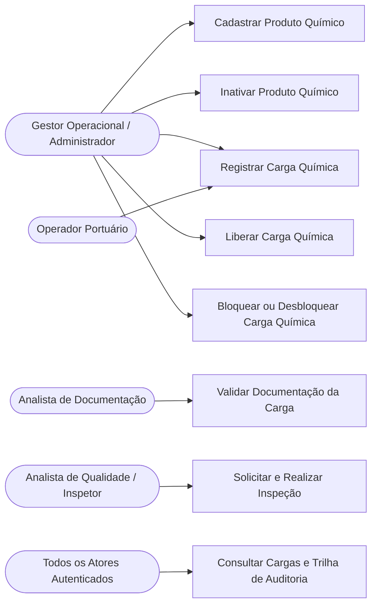
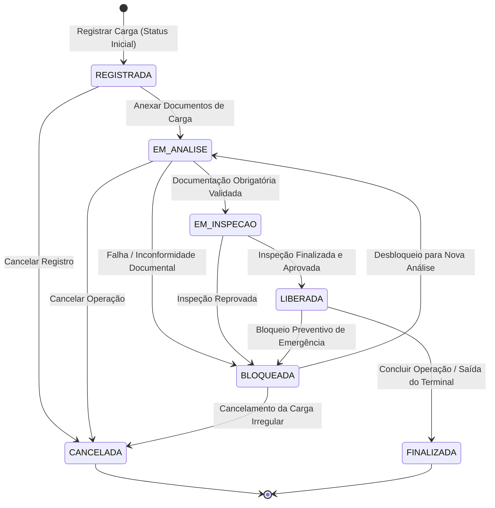

# 3. MAPEAMENTO DOS CASOS DE USO E FLUXOS DO SISTEMA

## 3.1 Diagrama da Visão Geral dos Atores e Casos de Uso

---

## 3.2 Especificação Detalhada dos Casos de Uso

### UC-001 — Cadastrar Produto Químico

- **Objetivo:** Manter um catálogo atualizado e seguro dos produtos químicos que circulam no porto, permitindo o registro de novos itens para associação com futuras cargas.
- **Ator Principal:** Gestor Operacional / Administrador.
- **Entrada Esperada:** `nomeComercial`, `nomeTecnico`, `classeRisco`, `subclasse`, `numeroONU`, `grupoEmbalagem`.
- **Saída Esperada:** Mensagem de sucesso e produto químico disponível no sistema no status `ATIVO`.
- **Fluxo Principal:**
  1. O ator informa os dados cadastrais do produto químico.
  2. O sistema valida se o nome comercial e a descrição técnica foram preenchidos (RN-PRQ-02).
  3. O sistema verifica se já existe um produto com o mesmo nome e classe de risco (RN-PRQ-06).
  4. O sistema valida o código ONU com 4 dígitos e a classificação de risco (RN-PRQ-03).
  5. O produto é salvo com ID gerado automaticamente e status `ATIVO` (RN-PRQ-01, RN-PRQ-04).
- **Regras de Negócio Relacionadas:** RN-PRQ-01, RN-PRQ-02, RN-PRQ-03, RN-PRQ-04, RN-PRQ-06.
- **Possíveis Erros ou Exceções:**
  - Tentativa de cadastrar produto com campos obrigatórios em branco (sistema bloqueia).
  - Cadastro de produto duplicado (mesmo nome e classe de risco) -> Lança erro de conflito de cadastro.

---

### UC-002 — Inativar Produto Químico

- **Objetivo:** Desativar produtos químicos que não devem mais ser associados a novas cargas que darem entrada no terminal.
- **Ator Principal:** Gestor Operacional (com aprovação de cargo superior).
- **Entrada Esperada:** `produtoQuimicoId`, `motivoInativacao`, `autorizacaoSuperiorId`.
- **Saída Esperada:** Mensagem de sucesso e status do produto alterado para `INATIVO`.
- **Fluxo Principal:**
  1. O gestor solicita a inativação informando o ID do produto e o motivo.
  2. O sistema verifica se a operação possui aprovação de cargo superior (RN-PRQ-07).
  3. O produto químico é atualizado para o status `INATIVO`.
  4. O produto fica indisponível para seleção em novos registros de carga (RN-PRQ-05).
- **Regras de Negócio Relacionadas:** RN-PRQ-05, RN-PRQ-07.
- **Possíveis Erros ou Exceções:**
  - Tentativa de inativação sem aprovação de cargo superior -> Operação negada.
  - Produto não localizado no banco de dados.

---

### UC-003 — Registrar Carga Química

- **Objetivo:** Efetuar o registro inicial de um lote/contêiner de carga química que chega ao terminal portuário.
- **Ator Principal:** Operador Portuário / Gestor Operacional.
- **Entrada Esperada:** `codigoIdentificacao`, `produtoQuimicoId`, `quantidade`, `responsavelTecnicoId`, `dataRegistro`.
- **Saída Esperada:** Mensagem de sucesso e carga registrada no sistema com status inicial `REGISTRADA` (Aguardando Documentação).
- **Fluxo Principal:**
  1. O operador informa os dados da carga, data e seleciona o produto e responsável técnico.
  2. O sistema verifica se a data de registro é retroativa (anterior a hoje); se for, exige aprovação superior (RN-CRQ-12).
  3. O sistema valida se o produto químico associado está `ATIVO` (RN-CRQ-02, RN-CRQ-08).
  4. O sistema valida se a quantidade informada é maior que zero (RN-CRQ-03).
  5. O sistema valida a presença de um responsável técnico (RN-CRQ-05).
  6. A carga é criada com ID automático e status inicial `REGISTRADA` (RN-CRQ-01, RN-CRQ-04).
- **Regras de Negócio Relacionadas:** RN-CRQ-01, RN-CRQ-02, RN-CRQ-03, RN-CRQ-04, RN-CRQ-05, RN-CRQ-08, RN-CRQ-12.
- **Possíveis Erros ou Exceções:**
  - Tentativa de registrar carga sem produto químico associado ou com produto inativo (operação bloqueada).
  - Quantidade menor ou igual a zero -> Alerta de validação.
  - Tentativa de registro com data retroativa sem aprovação superior.

---

### UC-004 — Validar Documentação da Carga

- **Objetivo:** Anexar, registrar e auditar a validade dos documentos legais obrigatórios vinculados à carga química.
- **Ator Principal:** Analista de Documentação.
- **Entrada Esperada:** `cargaId`, `tipoDocumentoId`, `numeroReferencia`, `dataValidade`, `arquivoUrl`.
- **Saída Esperada:** Documento anexado com ID próprio e status da carga atualizado para `EM_ANALISE`.
- **Fluxo Principal:**
  1. O analista seleciona a carga e cadastra os dados do documento obrigatório (FDS/laudos).
  2. O documento é criado com ID automático e status inicial `PENDENTE` (RN-DOC-01, RN-DOC-02, RN-DOC-03).
  3. O sistema valida a data de validade do documento em relação à data atual (RN-DOC-04).
  4. A carga vincula os documentos recebidos (RN-CRQ-06) e altera seu status para `EM_ANALISE`.
  5. Se algum documento obrigatório estiver vencido ou inválido, a documentação é rejeitada e a carga fica sujeita a bloqueio.
- **Regras de Negócio Relacionadas:** RN-CRQ-06, RN-DOC-01, RN-DOC-02, RN-DOC-03, RN-DOC-04.
- **Possíveis Erros ou Exceções:**
  - Inserção de documento sem tipo ou sem data de validade preenchida.
  - Anexo de documento com data de validade expirada (documento é marcado como inválido/rejeitado).

---

### UC-005 — Solicitar e Realizar Inspeção

- **Objetivo:** Registrar a vistoria física no pátio e o parecer do inspetor quanto à integridade da carga química.
- **Ator Principal:** Analista de Qualidade / Inspetor.
- **Entrada Esperada:** `cargaId`, `inspetorId`, `parecerVistoria` (`APROVADO` ou `REPROVADO`), `observacoesTecnicas`.
- **Saída Esperada:** Parecer gravado e status da carga atualizado (`LIBERADA` ou `BLOQUEADA`).
- **Fluxo Principal:**
  1. O sistema altera o status da carga para `EM_INSPECAO`.
  2. O inspetor realiza a vistoria presencial e registra o laudo final.
  3. Se o laudo for `APROVADO` e a documentação estiver ok, a carga avança no fluxo.
  4. Se a vistoria for `REPROVADA` (vazamentos, avarias em embalagens), a carga transiciona para `BLOQUEADA` (RN-CRQ-10).
  5. A vistoria de inspeção deve ser obrigatoriamente concluída antes que a carga possa ser liberada (RN-CRQ-07).
- **Regras de Negócio Relacionadas:** RN-CRQ-07, RN-CRQ-10.
- **Possíveis Erros ou Exceções:**
  - Tentativa de liberar a carga sem finalizar a inspeção pendente (sistema impede).

---

### UC-006 — Liberar Carga Química

- **Objetivo:** Emitir a autorização formal de liberação para movimentação, desembarque ou transporte da carga no porto.
- **Ator Principal:** Gestor Operacional.
- **Entrada Esperada:** `cargaId`, `justificativaLiberacao`.
- **Saída Esperada:** Carga atualizada para o status `LIBERADA` no sistema.
- **Fluxo Principal:**
  1. O gestor solicita a liberação da carga química.
  2. O sistema verifica se a documentação obrigatória foi validada e aprovada (RN-CRQ-09).
  3. O sistema verifica se a inspeção técnica de pátio foi finalizada com sucesso (RN-CRQ-07).
  4. O sistema confirma que a carga não possui bloqueios vigentes ou cancelamento (RN-CRQ-10, RN-CRQ-11).
  5. O status da carga é alterado para `LIBERADA`.
- **Regras de Negócio Relacionadas:** RN-CRQ-07, RN-CRQ-09, RN-CRQ-10, RN-CRQ-11.
- **Possíveis Erros ou Exceções:**
  - Tentativa de liberação sem a documentação obrigatória -> Operação bloqueada (RN-CRQ-09).
  - Tentativa de liberação com inspeção pendente ou reprovada -> Operação bloqueada.

---

### UC-007 — Bloquear ou Desbloquear Carga Química

- **Objetivo:** Interromper imediatamente qualquer movimentação da carga em caso de inconformidade ou liberar após saneamento.
- **Ator Principal:** Gestor Operacional.
- **Entrada Esperada:** `cargaId`, `motivoBloqueio` (ou `parecerDesbloqueio`).
- **Saída Esperada:** Carga com status alterado para `BLOQUEADA` (ou retornada para reanálise).
- **Fluxo Principal:**
  1. O gestor aciona o bloqueio preventivo ou o sistema bloqueia automaticamente por falha técnica/documental.
  2. O status altera para `BLOQUEADA`.
  3. Qualquer tentativa de movimentação, transbordo ou liberação é estritamente impedida (RN-CRQ-10).
  4. Após a correção das irregularidades, o gestor pode desbloquear a carga para nova análise.
- **Regras de Negócio Relacionadas:** RN-CRQ-10, RN-CRQ-11.
- **Possíveis Erros ou Exceções:**
  - Tentativa de movimentar uma carga com status `BLOQUEADA` (sistema bloqueia e emite alerta de segurança).
  - Tentativa de alterar o status de uma carga que foi `CANCELADA` (RN-CRQ-11).

---

### UC-008 — Consultar Cargas e Trilha de Auditoria

- **Objetivo:** Permitir a rastreabilidade completa das cargas, histórico de alterações de status e auditoria operacional.
- **Ator Principal:** Todos os Atores Autenticados.
- **Entrada Esperada:** Filtros (`status`, `codigoIdentificacao`, `produtoId`, `periodo`).
- **Saída Esperada:** Listagem de cargas e linha do tempo detalhada das movimentações.
- **Fluxo Principal:**
  1. O usuário insere os parâmetros de busca.
  2. O sistema exibe o resumo das cargas encontradas.
  3. Ao selecionar uma carga, o sistema apresenta o histórico de transições de status com data, hora, motivo e responsável.
- **Regras de Negócio Relacionadas:** RN-PRQ-01, RN-CRQ-01, RN-DOC-01.
- **Possíveis Erros ou Exceções:**
  - Nenhum registro localizado para os filtros informados.

---

## 3.3 Diagrama de Transição de Status da Carga

## 3.4 Matriz Consolidada de Transição de Status e Validações

| Status Atual      | Ação / Evento Trigger | Próximo Status | Invariantes e Regras de Validação Exigidas                                                                      |
| :---------------- | :-------------------- | :------------- | :-------------------------------------------------------------------------------------------------------------- |
| **Nenhum**        | `RegistrarCarga`      | `REGISTRADA`   | Produto deve estar `ATIVO` (RN-CRQ-02), quantidade > 0 (RN-CRQ-03) e responsável técnico associado (RN-CRQ-05). |
| **`REGISTRADA`**  | `AnexarDocumento`     | `EM_ANALISE`   | Permite vincular uma ou mais documentações (RN-CRQ-06).                                                         |
| **`EM_ANALISE`**  | `ValidarDocumentos`   | `EM_INSPECAO`  | Documentação obrigatória deve estar completa e com validade em dia (RN-CRQ-09, RN-DOC-04).                      |
| **`EM_INSPECAO`** | `ConcluirInspecao`    | `LIBERADA`     | Inspeção deve ser finalizada com parecer aprovado (RN-CRQ-07) e sem pendências documentais (RN-CRQ-09).         |
| **`EM_INSPECAO`** | `ReprovarInspecao`    | `BLOQUEADA`    | Parecer técnico reprovado coloca a carga em bloqueio operacional (RN-CRQ-10).                                   |
| **`BLOQUEADA`**   | `ResolverPendencia`   | `EM_ANALISE`   | Cargas bloqueadas não podem entrar em movimentação (RN-CRQ-10). Exige aprovação para retorno.                   |
| **`LIBERADA`**    | `FinalizarOperacao`   | `FINALIZADA`   | Movimentação concluída com sucesso no pátio.                                                                    |
| **`CANCELADA`**   | _Qualquer ação_       | _Nenhum_       | **ESTADO TERMINAL:** Uma carga cancelada não pode ter seu status alterado (RN-CRQ-11).                          |
