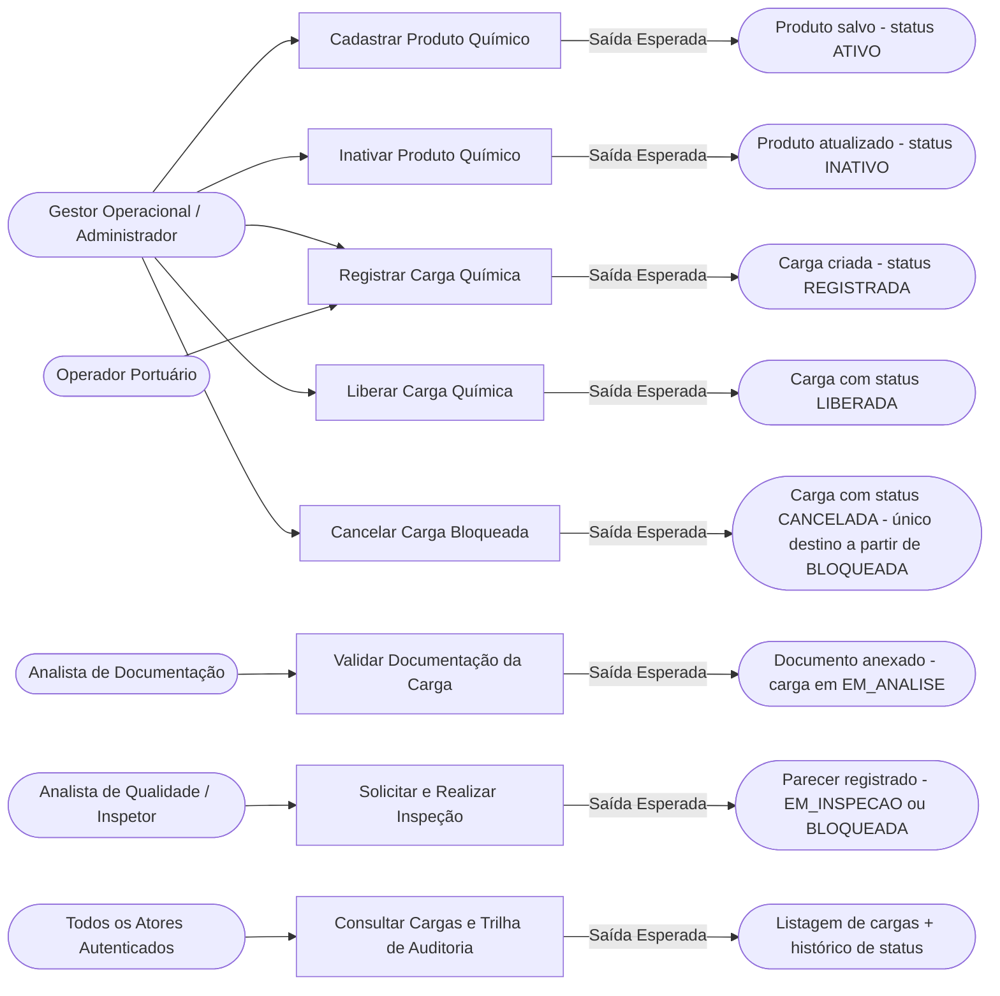
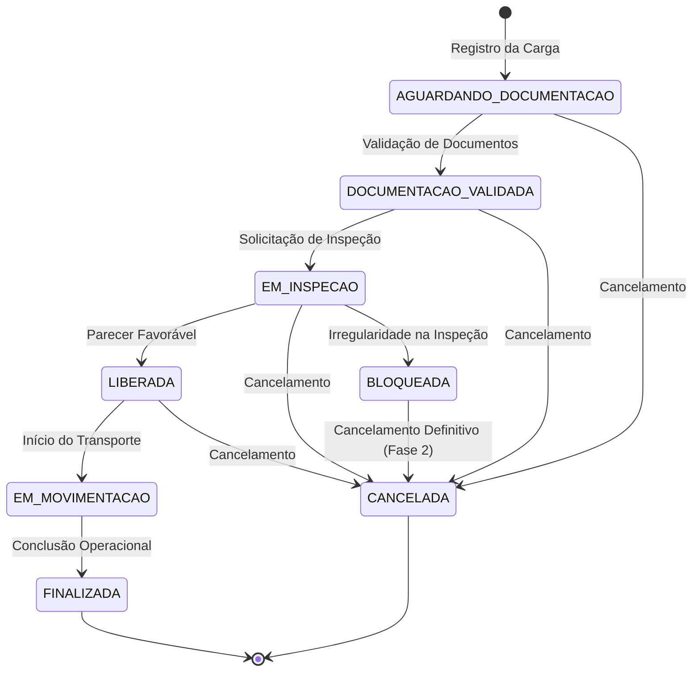

# 3. MAPEAMENTO DOS CASOS DE USO E FLUXOS DO SISTEMA

## 3.1 Diagrama da Visão Geral dos Atores e Casos de Uso

```mermaid
flowchart LR
  Gestor([Gestor Operacional / Administrador])
  Operador([Operador Portuário])
  Analista([Analista de Documentação])
  Qualidade([Analista de Qualidade / Inspetor])
  Todos([Todos os Atores Autenticados])

  Gestor --> UC1[Cadastrar Produto Químico]
  Gestor --> UC2[Inativar Produto Químico]
  Gestor --> UC3[Registrar Carga Química]
  Gestor --> UC6[Liberar Carga Química]
  Gestor --> UC7[Cancelar Carga Bloqueada]

  Operador --> UC3

  Analista --> UC4[Validar Documentação da Carga]

  Qualidade --> UC5[Solicitar e Realizar Inspeção]

  Todos --> UC8[Consultar Cargas e Trilha de Auditoria]

  UC1 -->|Saída Esperada| S1([Produto salvo - status ATIVO])
  UC2 -->|Saída Esperada| S2([Produto atualizado - status INATIVO])
  UC3 -->|Saída Esperada| S3([Carga criada - status REGISTRADA])
  UC4 -->|Saída Esperada| S4([Documento anexado - carga em EM_ANALISE])
  UC5 -->|Saída Esperada| S5([Parecer registrado - EM_INSPECAO ou BLOQUEADA])
  UC6 -->|Saída Esperada| S6([Carga com status LIBERADA])
  UC7 -->|Saída Esperada| S7([Carga com status CANCELADA - único destino a partir de BLOQUEADA])
  UC8 -->|Saída Esperada| S8([Listagem de cargas + histórico de status])
```
---

## 3.2 Especificação Detalhada dos Casos de Uso

### UC-001 — Cadastrar Produto Químico

- **Objetivo:** Manter um catálogo atualizado e seguro dos produtos químicos que circulam no porto, permitindo o registro de novos itens para associação com futuras cargas.
- **Ator Principal:** Gestor Operacional / Administrador.
- **Entrada Esperada:** `nome`, `descricao`, `grupoCompatibilidade`, `classeRisco`, `subclasse`, `numeroONU`, `grupoEmbalagem`, `dataAtualizacao`.
- **Saída Esperada:** Mensagem de sucesso, produto químico disponível no sistema no status `ATIVO` e com os campos `nome`, `descricao`, `grupoCompatibilidade` e `dataAtualizacao` persistidos corretamente.
- **Fluxo Principal:**
  1. O ator informa os dados cadastrais do produto químico.
  2. O sistema valida se o nome e a descrição do produto foram preenchidos e se o grupo de compatibilidade foi informado (RN-PRQ-02).
  3. O sistema verifica se já existe um produto com o mesmo nome e classe de risco (RN-PRQ-06).
  4. O sistema valida o código ONU com 4 dígitos e a classificação de risco (RN-PRQ-03).
  5. O produto é salvo com ID gerado automaticamente, `dataAtualizacao` registrada e status `ATIVO` (RN-PRQ-01, RN-PRQ-04).
- **Regras de Negócio Relacionadas:** RN-PRQ-01, RN-PRQ-02, RN-PRQ-03, RN-PRQ-04, RN-PRQ-06.
- **Possíveis Erros ou Exceções:**
  - Tentativa de cadastrar produto com campos obrigatórios em branco (sistema bloqueia).
  - Cadastro de produto duplicado (mesmo nome e classe de risco) -> Lança erro de conflito de cadastro.

---

### UC-002 — Inativar Produto Químico

- **Objetivo:** Desativar produtos químicos que não devem mais ser associados a novas cargas que derem entrada no terminal.
- **Ator Principal:** Gestor Operacional (com aprovação de cargo superior).
- **Entrada Esperada:** `produtoQuimicoId`, `motivoInativacao`, `autorizacaoSuperiorId`.
- **Saída Esperada:** Mensagem de sucesso e status do produto alterado para `INATIVO`.
- **Fluxo Principal:**
  1. O gestor solicita a inativação informando o ID do produto e o motivo.
  2. O sistema verifica se a operação possui aprovação de cargo superior (RN-PRQ-07).
  3. O produto químico é atualizado para o status `INATIVO`.
  4. O produto fica indisponível para seleção em novos registros de carga (RN-PRQ-05).
- **Regras de Negócio Relacionadas:** RN-PRQ-05, RN-PRQ-07.
- **Possíveis Erros ou Exceções:**
  - Tentativa de inativação sem aprovação de cargo superior -> Operação negada.
  - Produto não localizado no banco de dados.

---

### UC-003 — Registrar Carga Química

- **Objetivo:** Efetuar o registro inicial de um lote/contêiner de carga química que chega ao terminal portuário.
- **Ator Principal:** Operador Portuário / Gestor Operacional.
- **Entrada Esperada:** `codigoIdentificacao`, `produtoQuimicoId`, `quantidade`, `responsavelTecnicoId`, `origem`, `destino`, `dataEntrada`, `grupoCompatibilidade`.
- **Saída Esperada:** Mensagem de sucesso, carga registrada no sistema com status inicial `REGISTRADA` (Aguardando Documentação) e com os campos de origem, destino, data de entrada e grupo de compatibilidade persistidos corretamente.
- **Fluxo Principal:**
  1. O operador informa os dados da carga, a origem, o destino, a data de entrada e seleciona o produto e responsável técnico.
  2. O sistema verifica se a data de entrada é retroativa (anterior a hoje); se for, exige aprovação superior (RN-CRQ-12).
  3. O sistema valida se o produto químico associado está `ATIVO` e se o grupo de compatibilidade da carga coincide com o do produto (RN-CRQ-02, RN-CRQ-08).
  4. O sistema valida se a quantidade informada é maior que zero (RN-CRQ-03).
  5. O sistema valida a presença de um responsável técnico e dos campos de origem/destino obrigatórios (RN-CRQ-05).
  6. A carga é criada com ID automático, `dataEntrada` registrada e status inicial `REGISTRADA` (RN-CRQ-01, RN-CRQ-04).
- **Regras de Negócio Relacionadas:** RN-CRQ-01, RN-CRQ-02, RN-CRQ-03, RN-CRQ-04, RN-CRQ-05, RN-CRQ-08, RN-CRQ-12.
- **Possíveis Erros ou Exceções:**
  - Tentativa de registrar carga sem produto químico associado ou com produto inativo (operação bloqueada).
  - Quantidade menor ou igual a zero -> Alerta de validação.
  - Tentativa de registro com data retroativa sem aprovação superior.

---

### UC-004 — Validar Documentação da Carga

- **Objetivo:** Anexar, registrar e auditar a validade dos documentos legais obrigatórios vinculados à carga química.
- **Ator Principal:** Analista de Documentação.
- **Entrada Esperada:** `cargaId`, `tipoDocumentoId`, `numeroReferencia`, `dataValidade`, `arquivoUrl`.
- **Saída Esperada:** Documento anexado com ID próprio e status da carga atualizado para `EM_ANALISE`.
- **Fluxo Principal:**
  1. O analista seleciona a carga e cadastra os dados do documento obrigatório (FDS/laudos).
  2. O documento é criado com ID automático e status inicial `PENDENTE` (RN-DOC-01, RN-DOC-02, RN-DOC-03).
  3. O sistema valida a data de validade do documento em relação à data atual (RN-DOC-04).
  4. A carga vincula os documentos recebidos (RN-CRQ-06) e altera seu status para `EM_ANALISE`.
  5. O vencimento é calculado por `dataValidade < agora`; `EXPIRADO` não é persistido como status. Se algum documento obrigatório estiver vencido, pendente ou rejeitado, a carga não avança para inspeção e pode ser bloqueada.
- **Regras de Negócio Relacionadas:** RN-CRQ-06, RN-DOC-01, RN-DOC-02, RN-DOC-03, RN-DOC-04.
- **Possíveis Erros ou Exceções:**
  - Inserção de documento sem tipo ou sem data de validade preenchida.
  - Anexo de documento com data de validade vencida (o cadastro pode ser preservado para auditoria, mas o documento não satisfaz o checklist de liberação).

---

### UC-005 — Solicitar e Realizar Inspeção

- **Objetivo:** Registrar a vistoria física no pátio e o parecer do inspetor quanto à integridade da carga química.
- **Ator Principal:** Analista de Qualidade / Inspetor.
- **Entrada Esperada:** `cargaId`, `inspetorId`, `parecerVistoria` (`APROVADO` ou `REPROVADO`), `observacoesTecnicas`.
- **Saída Esperada:** Parecer gravado; a carga permanece `EM_INSPECAO` quando aprovada, aguardando a liberação formal do UC-006, ou vai para `BLOQUEADA` quando reprovada.
- **Fluxo Principal:**
  1. O sistema altera o status da carga para `EM_INSPECAO`.
  2. O inspetor realiza a vistoria presencial e registra o laudo final.
  3. Se o laudo for `APROVADO`, o parecer fica disponível para o UC-006; a inspeção não libera a carga automaticamente.
  4. Se a vistoria for `REPROVADA` (vazamentos, avarias em embalagens), a carga transiciona para `BLOQUEADA` (RN-CRQ-10).
  5. A vistoria de inspeção deve ser obrigatoriamente concluída antes que a carga possa ser liberada (RN-CRQ-07).
- **Regras de Negócio Relacionadas:** RN-CRQ-07, RN-CRQ-10.
- **Possíveis Erros ou Exceções:**
  - Tentativa de liberar a carga sem finalizar a inspeção pendente (sistema impede).

---

### UC-006 — Liberar Carga Química

- **Objetivo:** Emitir a autorização formal de liberação para movimentação, desembarque ou transporte da carga no porto.
- **Ator Principal:** Gestor Operacional.
- **Entrada Esperada:** `cargaId`, `justificativaLiberacao`.
- **Saída Esperada:** Carga atualizada para o status `LIBERADA` no sistema.
- **Fluxo Principal:**
  1. O gestor solicita a liberação da carga química.
  2. O sistema verifica, no instante da decisão, se toda a documentação obrigatória está validada, aprovada e não vencida (RN-CRQ-09, RN-DOC-05).
  3. O sistema verifica se a inspeção técnica de pátio foi finalizada com sucesso (RN-CRQ-07).
  4. O sistema confirma que a carga não possui bloqueios vigentes ou cancelamento (RN-CRQ-10, RN-CRQ-11).
  5. O status da carga é alterado para `LIBERADA`.
- **Regras de Negócio Relacionadas:** RN-CRQ-07, RN-CRQ-09, RN-CRQ-10, RN-CRQ-11.
- **Possíveis Erros ou Exceções:**
  - Tentativa de liberação sem a documentação obrigatória -> Operação bloqueada (RN-CRQ-09).
  - Tentativa de liberação com inspeção pendente ou reprovada -> Operação bloqueada.

---

### UC-007 — Cancelar Carga Bloqueada

- **Objetivo:** Formalizar o cancelamento definitivo de uma carga que foi bloqueada por irregularidade na inspeção, já que a Fase 2 não contempla desbloqueio operacional — `BLOQUEADA` só é alcançada a partir de `EM_INSPECAO` (UC-005) e só evolui para `CANCELADA`.
- **Ator Principal:** Gestor Operacional.
- **Entrada Esperada:** `cargaId`, `motivoCancelamento`.
- **Saída Esperada:** Carga com status alterado para `CANCELADA`.
- **Fluxo Principal:**
  1. A carga chega ao status `BLOQUEADA` automaticamente a partir de um parecer de inspeção reprovado (UC-005), não por ação direta do gestor.
  2. Qualquer tentativa de movimentação, transbordo ou liberação é estritamente impedida enquanto a carga estiver `BLOQUEADA` (RN-CRQ-10).
  3. O gestor registra o cancelamento definitivo, informando o motivo.
  4. O status altera para `CANCELADA` — único destino possível a partir de `BLOQUEADA` nesta fase.
- **Regras de Negócio Relacionadas:** RN-CRQ-10, RN-CRQ-11.
- **Possíveis Erros ou Exceções:**
  - Tentativa de movimentar ou liberar uma carga com status `BLOQUEADA` (sistema bloqueia e emite alerta de segurança).
  - Tentativa de desbloquear a carga para reanálise — não suportado na Fase 2; postergado para a Fase 3.
  - Tentativa de alterar o status de uma carga que foi `CANCELADA` (RN-CRQ-11).

---

### UC-008 — Consultar Cargas e Trilha de Auditoria

- **Objetivo:** Permitir a rastreabilidade completa das cargas, histórico de alterações de status e auditoria operacional.
- **Ator Principal:** Todos os Atores Autenticados.
- **Entrada Esperada:** Filtros (`status`, `codigoIdentificacao`, `produtoId`, `periodo`).
- **Saída Esperada:** Listagem de cargas e linha do tempo detalhada das movimentações.
- **Fluxo Principal:**
  1. O usuário insere os parâmetros de busca.
  2. O sistema exibe o resumo das cargas encontradas.
  3. Ao selecionar uma carga, o sistema apresenta o histórico de transições de status com data, hora, motivo e responsável.
- **Regras de Negócio Relacionadas:** RN-PRQ-01, RN-CRQ-01, RN-DOC-01.
- **Possíveis Erros ou Exceções:**
  - Nenhum registro localizado para os filtros informados.

---

## 3.3 Diagrama de Transição de Status da Carga

```mermaid
stateDiagram-v2
    [*] --> AGUARDANDO_DOCUMENTACAO: Registro da Carga

    AGUARDANDO_DOCUMENTACAO --> DOCUMENTACAO_VALIDADA: Validação de Documentos
    AGUARDANDO_DOCUMENTACAO --> CANCELADA: Cancelamento

    DOCUMENTACAO_VALIDADA --> EM_INSPECAO: Solicitação de Inspeção
    DOCUMENTACAO_VALIDADA --> CANCELADA: Cancelamento

    EM_INSPECAO --> LIBERADA: Parecer Favorável
    EM_INSPECAO --> CANCELADA: Cancelamento
    EM_INSPECAO --> BLOQUEADA: Irregularidade na Inspeção

    LIBERADA --> EM_MOVIMENTACAO: Início do Transporte
    LIBERADA --> CANCELADA: Cancelamento

    EM_MOVIMENTACAO --> FINALIZADA: Conclusão Operacional

    BLOQUEADA --> CANCELADA: Cancelamento Definitivo (Fase 2)

    FINALIZADA --> [*]
    CANCELADA --> [*]
```

## 3.4 Matriz Consolidada de Transição de Status e Validações

| Status Atual | Ação / Evento Trigger | Próximo Status | Invariantes e Regras de Validação Exigidas |
| :----------- | :-------------------- | :------------- | :----------------------------------------- |
| **`AGUARDANDO_DOCUMENTACAO`** | `ValidarDocumentos` | `DOCUMENTACAO_VALIDADA` | Documentação obrigatória e dados do registro devem estar consistentes para avançar. |
| **`AGUARDANDO_DOCUMENTACAO`** | `CancelarCarga` | `CANCELADA` | Cancelamento permitido enquanto a carga ainda não finalizou etapa operacional. |
| **`DOCUMENTACAO_VALIDADA`** | `SolicitarInspecao` | `EM_INSPECAO` | A carga deve ter documentação válida e sem pendências antes da inspeção. |
| **`DOCUMENTACAO_VALIDADA`** | `CancelarCarga` | `CANCELADA` | Cancelamento válido quando a operação é abortada após validação documental. |
| **`EM_INSPECAO`** | `LiberarCarga` | `LIBERADA` | Parecer de inspeção favorável e condições operacionais atendidas. |
| **`EM_INSPECAO`** | `CancelarCarga` | `CANCELADA` | Cancelamento permitido quando a carga deixa de ser viável após inspeção. |
| **`EM_INSPECAO`** | `BloquearCarga` | `BLOQUEADA` | Irregularidade técnica ou operacional provoca bloqueio imediato. **Único ponto de entrada para `BLOQUEADA`**, conforme o enunciado da Fase 2. |
| **`LIBERADA`** | `IniciarMovimentacao` | `EM_MOVIMENTACAO` | A carga já foi liberada e segue para transporte ou embarque. |
| **`LIBERADA`** | `CancelarCarga` | `CANCELADA` | Cancelamento válido antes da conclusão da movimentação. |
| **`EM_MOVIMENTACAO`** | `ConcluirOperacao` | `FINALIZADA` | Conclusão operacional do ciclo de transporte/desembarque. Estado terminal; sem saída para `CANCELADA` ou `BLOQUEADA` a partir daqui. |
| **`BLOQUEADA`** | `CancelarCarga` | `CANCELADA` | **Fase 2:** a única saída permitida do bloqueio é o cancelamento definitivo. |
| **`FINALIZADA`** | _Qualquer ação_ | _Nenhum_ | **ESTADO TERMINAL:** não aceita nenhuma transição posterior. |
| **`CANCELADA`** | _Qualquer ação_ | _Nenhum_ | **ESTADO TERMINAL:** não aceita nenhuma transição posterior. |

> Regras de validação: a máquina de estados do QuimiPort aceita apenas as 11 transições acima — alinhadas estritamente ao fluxo principal e aos fluxos alternativos definidos no enunciado do Tech Challenge Fase 2. Qualquer outro caminho deve ser rejeitado explicitamente como transição inválida. `BLOQUEADA` só é alcançável a partir de `EM_INSPECAO`. O desbloqueio operacional de cargas fica postergado para a Fase 3; na Fase 2, `BLOQUEADA` somente pode evoluir para `CANCELADA`.
