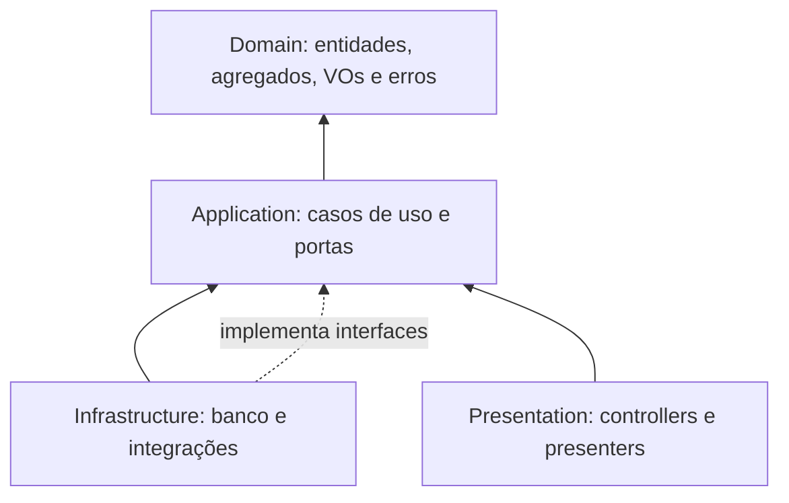

# 5. ARQUITETURA E ESTRUTURA DO PROJETO

## 5.1 Clean Architecture organizada em camadas

O QuimiPort adota **Clean Architecture organizada em camadas**. “Camadas” descreve a organização do código; Clean Architecture define a direção das dependências e mantém regras de negócio independentes de banco, HTTP e frameworks.



| Camada | Responsabilidade | Pode depender de |
| :--- | :--- | :--- |
| `domain` | Entidades, agregados, Value Objects, enums, invariantes e erros de negócio | Nada externo ao domínio |
| `application` | Casos de uso, DTOs de entrada/saída e interfaces (*ports*) | `domain` |
| `presentation` | Controllers, validação de formato e tradução HTTP | `application` |
| `infrastructure` | Banco, ORM, filas, relógio e implementações dos contratos | `application` e `domain` apenas para mapear dados |

As dependências de código apontam para dentro. Um caso de uso não importa controller, ORM ou framework. A infraestrutura implementa interfaces definidas pela aplicação e é injetada na composição do sistema.

## 5.2 Estrutura planejada em TypeScript

```text
src/
├── modules/
│   ├── gestao-cargas/
│   │   ├── domain/
│   │   ├── application/
│   │   ├── infrastructure/
│   │   └── presentation/
│   ├── catalogo-quimico/
│   │   ├── domain/
│   │   ├── application/
│   │   ├── infrastructure/
│   │   └── presentation/
│   └── compliance/
│       ├── domain/
│       ├── application/
│       ├── infrastructure/
│       └── presentation/
├── shared/
│   ├── domain/either.ts
│   └── infrastructure/
└── main.ts
```

O diretório `shared` contém apenas elementos realmente transversais. Regras específicas permanecem no módulo proprietário. Imports entre módulos passam pelas APIs públicas de aplicação, nunca pelas entidades internas nem por tabelas.

## 5.3 Aplicação explícita de JavaScript/TypeScript

| Recurso | Onde entra | Finalidade no QuimiPort |
| :--- | :--- | :--- |
| **Interfaces** | Portas em `application/ports`, como `ProdutoQuimicoQuery` e `CargaRepository` | Define contratos e permite trocar banco ou integração sem alterar casos de uso |
| **Enums** | Domínio: `StatusCarga`, `StatusValidacao`, `ResultadoInspecao` | Restringe estados válidos; `EXPIRADO` não integra `StatusValidacao` |
| **Generics** | `Either<E, A>`, `Repository<T, ID>` e `Page<T>` | Reutiliza estruturas preservando tipos de erro, sucesso e entidade |
| **Funções puras** | `estaVencido(dataValidade, agora)` e validações de transição | Produz o mesmo resultado para as mesmas entradas e facilita testes |
| **async/await** | Casos de uso e adaptadores de infraestrutura | Orquestra I/O assíncrono; entidades do domínio continuam síncronas |
| **Tratamento de erros** | `Either` para falhas esperadas; `try/catch` na borda para falhas técnicas | Separa erros de negócio de indisponibilidade de banco/rede |
| **Contratos** | DTOs, interfaces de portas e retornos tipados | Torna entradas, saídas e falhas explícitas entre camadas e contextos |

Exemplo representativo:

```typescript
export enum StatusValidacao {
  PENDENTE = 'PENDENTE',
  VALIDADO = 'VALIDADO',
  REJEITADO = 'REJEITADO',
}

export type Either<E, A> =
  | { readonly kind: 'left'; readonly error: E }
  | { readonly kind: 'right'; readonly value: A };

export interface ProdutoQuimicoQuery {
  buscarAtivoPorId(id: string): Promise<ProdutoQuimicoResumo | null>;
}

export const estaVencido = (dataValidade: Date, agora: Date): boolean =>
  dataValidade.getTime() < agora.getTime();

type LiberarCargaError =
  | CargaNaoEncontradaError
  | DocumentoObrigatorioAusenteError
  | DocumentoPendenteError
  | DocumentoRejeitadoError
  | DocumentoVencidoError
  | InspecaoNaoAprovadaError
  | CargaBloqueadaError
  | CargaCanceladaError;

export class LiberarCarga {
  constructor(
    private readonly cargas: CargaRepository,
    private readonly clock: Clock,
  ) {}

  async execute(input: LiberarCargaInput): Promise<Either<LiberarCargaError, CargaDTO>> {
    const carga = await this.cargas.buscarPorId(input.cargaId);
    if (!carga) {
      return { kind: 'left', error: new CargaNaoEncontradaError(input.cargaId) };
    }

    const resultado = carga.liberar(this.clock.now());
    if (resultado.kind === 'left') return resultado;

    await this.cargas.salvar(carga);
    return { kind: 'right', value: CargaMapper.toDTO(carga) };
  }
}
```

## 5.4 Por que usar Either / Result

`Either<Erro, Sucesso>` evita usar exceções como fluxo normal para decisões previsíveis do negócio. Sua assinatura obriga quem chama a tratar sucesso e falha e informa quais resultados são possíveis.

No QuimiPort, `Left` representa falhas recuperáveis: produto inativo ou duplicado, quantidade inválida, responsável técnico ausente/inválido, documento obrigatório ausente, pendente, rejeitado ou vencido, inspeção pendente/reprovada, carga bloqueada, transição inválida e carga cancelada/finalizada. `Right` contém o resultado bem-sucedido.

Exceções e `try/catch` ficam reservados para falhas técnicas inesperadas, como indisponibilidade do banco, timeout ou erro de rede. A apresentação converte `Left` em resposta adequada e uma exceção técnica em 500/503, sem expor detalhes internos.

## 5.5 Práticas adotadas sem ampliar o escopo

| Prática | Uso |
| :--- | :--- |
| DDD | Linguagem ubíqua, Bounded Contexts, agregados e invariantes |
| Rich Domain Model | Comportamentos e transições protegidos pelas entidades |
| Dependency Inversion | Casos de uso dependem de interfaces |
| Repository | Persistência orientada aos limites dos agregados |
| Either / Result | Falhas de negócio explícitas e tipadas |

Novos padrões só serão adicionados quando resolverem um problema concreto. A prioridade desta fase é manter consistentes regras, casos de uso, estados, contratos e testes.
