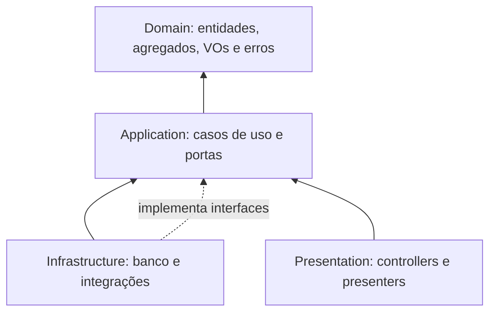

# 5. ARQUITETURA E ESTRUTURA DO PROJETO

## 5.1 Clean Architecture organizada em camadas

O QuimiPort adota **Clean Architecture organizada em camadas**. “Camadas” descreve a organização do código; Clean Architecture define a direção das dependências e mantém regras de negócio independentes de banco, HTTP e frameworks.


```mermaid
flowchart BT
    INF[Infrastructure: banco e integrações] --> APP[Application: casos de uso e portas]
    PRE[Presentation: controllers e presenters] --> APP
    APP --> DOM[Domain: entidades, agregados, VOs e erros]
    INF -. implementa interfaces .-> APP
```

| Camada           | Responsabilidade                                                           | Pode depender de                                  |
| :--------------- | :------------------------------------------------------------------------- | :------------------------------------------------ |
| `domain`         | Entidades, agregados, Value Objects, enums, invariantes e erros de negócio | Nada externo ao domínio                           |
| `application`    | Casos de uso, DTOs de entrada/saída e interfaces (_ports_)                 | `domain`                                          |
| `presentation`   | Controllers, validação de formato e tradução HTTP                          | `application`                                     |
| `infrastructure` | Banco, ORM, filas, relógio e implementações dos contratos                  | `application` e `domain` apenas para mapear dados |

As dependências de código apontam para dentro. Um caso de uso não importa controller, ORM ou framework. A infraestrutura implementa interfaces definidas pela aplicação e é injetada na composição do sistema.

## 5.2 Estrutura planejada em TypeScript

```text
src/
├── domain/                               # Camada de Domínio (Core da Aplicação)
│   ├── aggregates/                       # Agregados Principais
│   │   └── carga-quimica/
│   │       ├── carga-quimica.aggregate.ts# Raiz do Agregado (Aggregate Root)
│   │       ├── status-carga.enum.ts      # Enum / State Machine de Status
│   │       └── documento-carga.entity.ts # Entidade do Agregado [RN-DOC]
│   ├── entities/                         # Entidades Independentes
│   │   ├── produto-quimico.entity.ts     # Entidade de Produto [RN-PRQ]
│   │   ├── responsavel-tecnico.entity.ts # Entidade de Responsável [RN-RTC]
│   │   ├── inspecao.entity.ts           # Entidade de Inspeção [RN-INS]
│   │   └── area-armazenamento.entity.ts  # Entidade de Armazenamento [RN-ARM]
│   ├── value-objects/                    # Objetos de Valor Imutáveis
│   │   ├── classificacao-risco.vo.ts     # Classe de risco / ONU [RN-PRQ-03]
│   │   ├── quantidade-carga.vo.ts        # Quantidade e Unidade [RN-CRQ-03]
│   │   ├── cpf.vo.ts                     # Validação de CPF [RN-RTC-02]
│   │   └── registro-profissional.vo.ts   # CRQ/CREA [RN-RTC-03]
│   ├── repositories/                     # Interfaces/Contratos (Sem implementação)
│   │   ├── carga-quimica.repository.interface.ts
│   │   ├── produto-quimico.repository.interface.ts
│   │   └── area-armazenamento.repository.interface.ts
│   └── errors/                           # Erros de Domínio Personalizados
│       └── domain.error.ts
│
├── application/                          # Camada de Aplicação (Casos de Uso)
│   ├── use-cases/                        # Implementação dos Casos de Uso
│   │   ├── produtos/
│   │   │   ├── cadastrar-produto.use-case.ts
│   │   │   └── inativar-produto.use-case.ts
│   │   ├── cargas/
│   │   │   ├── registrar-carga.use-case.ts
│   │   │   ├── validar-documentacao.use-case.ts
│   │   │   ├── liberar-carga.use-case.ts
│   │   │   └── bloquear-carga.use-case.ts
│   │   └── inspecoes/
│   │       └── realizar-inspecao.use-case.ts
│   └── dtos/                             # Data Transfer Objects
│       ├── carga-quimica.dto.ts
│       └── produto-quimico.dto.ts
│
├── infrastructure/                       # Camada de Infraestrutura
│   ├── database/                         # Persistência e Mapeamento
│   │   └── repositories/                 # Implementação Concreta das Interfaces
│   └── shared/                           # Padrão Either e Result Types
│
└── presentation/                         # Camada de Apresentação
    └── controllers/                      # Controllers da API REST
```

## 5.3 Persistência Relacional e Mapeamento do Banco de Dados

O QuimiPort formaliza a adoção de um banco de dados relacional, com PostgreSQL como base de persistência e TypeORM como camada de mapeamento e acesso ao banco no backend. A decisão é coerente com o domínio crítico do sistema, em que cargas perigosas exigem rastreabilidade completa, integridade referencial, auditoria de mudanças de status e validação documental antes da liberação operacional.

A persistência será organizada em torno do relacionamento semântico principal do domínio:

- `produto_quimico` → origem do cadastro de referência do material
- `carga_quimica` → registro operacional da carga associada a um produto
- `documento_carga` → documentos exigidos para conformidade da carga
- `historico_status_carga` → trilha de auditoria das transições do ciclo de vida da carga

### 5.3.1 Modelo relacional recomendado

| Entidade / Tabela        | Chave Primária (PK) | Chaves Estrangeiras (FK)                   | Descrição                                                                                                                                |
| :----------------------- | :------------------ | :----------------------------------------- | :--------------------------------------------------------------------------------------------------------------------------------------- |
| `produto_quimico`        | `id`                | —                                          | Catálogo do produto químico, com classificação de risco, status ativo/inativo e dados de referência.                                     |
| `carga_quimica`          | `id`                | `produto_quimico_id -> produto_quimico.id` | Representa a carga física/operacional vinculada a um produto. Armazena o status atual e a data de criação da carga.                     |
| `documento_carga`        | `id`                | `carga_quimica_id -> carga_quimica.id`     | Documentos obrigatórios ou complementares da carga (FDS/FISPQ, licenças, laudos e comprovantes).                                         |
| `historico_status_carga` | `id`                | `carga_quimica_id -> carga_quimica.id`     | Registro de auditoria de todas as transições de status realizadas pela máquina de estados.                                               |
| `responsavel_tecnico`    | `id`                | —                                          | Dados do responsável técnico que assina ou valida a operação e a conformidade da carga.                                                  |
| `inspecao`               | `id`                | `carga_quimica_id -> carga_quimica.id`     | Registra a inspeção operacional e seus resultados (aprovado/reprovado).                                                                  |
| `area_armazenamento`     | `id`                | —                                          | Referência de pátio, armazém ou área de estocagem vinculada à operação.                                                                  |

`carga_quimica.responsavel_tecnico_id` referencia `responsavel_tecnico.id` e é obrigatório. O cadastro de responsáveis técnicos é feito pela API e o caso de uso de registro de carga verifica a existência do responsável antes de criar o agregado.

### 5.3.2 Estrutura do relacionamento principal

```text
produto_quimico (1) ───< (N) carga_quimica
responsavel_tecnico (1) ───< (N) carga_quimica
carga_quimica (1) ───< (N) documento_carga
carga_quimica (1) ───< (N) historico_status_carga
carga_quimica (1) ───< (N) inspecao
```

Essa estrutura respeita a regra de negócio de que um produto pode ser reutilizado em várias cargas, mas cada carga pertence a um único produto. Do mesmo modo, cada carga pode possuir múltiplos documentos e múltiplos registros de histórico de status, sendo o histórico a fonte de auditoria da sequência de estados e da trilha operacional.

### 5.3.3 Status atual da carga e enumeração do domínio

A tabela `carga_quimica` manterá o status atual da carga em uma coluna `status` mapeada para a enumeração `StatusCarga` do domínio. A enumeração oficial do QuimiPort é composta pelos 8 estados abaixo:

```ts
export enum StatusCarga {
  AGUARDANDO_DOCUMENTACAO = "AGUARDANDO_DOCUMENTACAO",
  DOCUMENTACAO_VALIDADA = "DOCUMENTACAO_VALIDADA",
  EM_INSPECAO = "EM_INSPECAO",
  LIBERADA = "LIBERADA",
  EM_MOVIMENTACAO = "EM_MOVIMENTACAO",
  FINALIZADA = "FINALIZADA",
  BLOQUEADA = "BLOQUEADA",
  CANCELADA = "CANCELADA",
}
```

No mapeamento com TypeORM, a coluna pode ser persistida como `enum` nativo do PostgreSQL ou como `varchar` com validação pela aplicação, conforme estratégia de schema definida no backend. O importante é que a tabela preserve o status corrente da carga em um único campo obrigatório, refletindo sempre o estado operational atual em que a carga se encontra.

### 5.3.4 Histórico de status e auditoria operacional

A tabela `historico_status_carga` será responsável por manter a rastreabilidade e a auditoria de todas as alterações de status sofridas por uma carga. Ela não substitui o status atual da carga; ela complementa a visão atual com a linha do tempo das mudanças.

Os campos mínimos esperados incluem:

- `id` (PK)
- `carga_quimica_id` (FK para `carga_quimica.id`)
- `sequencia` (ordem única e estável do evento dentro da carga)
- `status_anterior` (valor do status antes da transição)
- `status_novo` (valor do status após a transição)
- `data_hora` (timestamp da transição)
- `responsavel_id` ou `usuario_id` (quem executou a ação)
- `motivo` (obrigatório nas transições; descreve a razão operacional da alteração)

A criação da carga também registra um evento inicial com `status_anterior` nulo, `status_novo` igual ao estado inicial, `data_hora` igual a `data_criacao`, o responsável técnico e o motivo `Carga criada.`. A persistência do histórico permite reconstituir, em qualquer momento, a sequência de transições executadas pela máquina de estados do domínio. Cada evento deve possuir uma sequência estável por carga para que a reidratação preserve a ordem mesmo quando dois eventos tiverem o mesmo timestamp. Por exemplo:

Cargas existentes antes da ativação dessa tabela precisam de backfill explícito do evento inicial antes de serem lidas pelo repositório com histórico. A aplicação não infere transições passadas nem cria uma trilha fictícia; a reidratação falha explicitamente se a trilha estiver ausente ou inconsistente.

```text
AGUARDANDO_DOCUMENTACAO -> DOCUMENTACAO_VALIDADA -> EM_INSPECAO -> LIBERADA -> EM_MOVIMENTACAO -> FINALIZADA
```

ou, em cenários de exceção:

```text
DOCUMENTACAO_VALIDADA -> BLOQUEADA -> CANCELADA
```

Esse registro é essencial para auditoria, conformidade regulatória e análise operacional em incidentes, bloqueios e cancelamentos.

### 5.3.5 Considerações de implementação com TypeORM

O TypeORM será usado para mapear as entidades do domínio para o modelo relacional, mantendo a separação entre domínio e infraestrutura. Em prática, a camada de infraestrutura implementará as entidades ORM com relação explícita entre:

- `ProdutoQuimico` e `CargaQuimica`
- `CargaQuimica` e `DocumentoCarga`
- `CargaQuimica` e `HistoricoStatusCarga`
- `CargaQuimica` e `Inspecao`

A persistência em PostgreSQL favorece:

- integridade referencial com FKs;
- consultas e relatórios de auditoria e rastreabilidade por carga;
- suporte a transações críticas para validação documental e alteração de status;
- compatibilidade com a modelagem de regras de negócio críticas em um sistema portuário.

## 5.4 Recursos Avançados do TypeScript no Projeto

    A aplicação utiliza os recursos do TypeScript para garantir a segurança de tipos e o cumprimento das invariantes de DDD:

    Interfaces Estritas para Contratos: O Domínio define interfaces (ICargaQuimicaRepository) garantindo que a aplicação dependa de abstrações, e   não de implementações de banco de dados.

    Enums Nativos para Estado: A máquina de estados da carga utiliza enum StatusCarga (REGISTRADA, EM_ANALISE, EM_INSPECAO, LIBERADA, BLOQUEADA, CANCELADA, FINALIZADA), impedindo valores inválidos em tempo de compilação.

    Value Objects Imutáveis com Getters Privados: Os Value Objects (CPF, ClassificacaoRisco) utilizam propriedades readonly e construtores privados com métodos estáticos de fábrica (CPF.create()) para garantir imutabilidade.

    Tipagem Funcional com Tipo Result / Either: Tratamento de erros de domínio sem disparar exceções pesadas na call-stack, utilizando o tipo   Either<DomainError, SuccessResult>.

O diretório `shared` contém apenas elementos realmente transversais. Regras específicas permanecem no módulo proprietário. Imports entre módulos passam pelas APIs públicas de aplicação, nunca pelas entidades internas nem por tabelas.

## 5.3 Aplicação explícita de JavaScript/TypeScript

| Recurso                 | Onde entra                                                                    | Finalidade no QuimiPort                                                        |
| :---------------------- | :---------------------------------------------------------------------------- | :----------------------------------------------------------------------------- |
| **Interfaces**          | Portas em `application/ports`, como `ProdutoQuimicoQuery` e `CargaRepository` | Define contratos e permite trocar banco ou integração sem alterar casos de uso |
| **Enums**               | Domínio: `StatusCarga`, `StatusValidacao`, `ResultadoInspecao`                | Restringe estados válidos; `EXPIRADO` não integra `StatusValidacao`            |
| **Generics**            | `Either<E, A>`, `Repository<T, ID>` e `Page<T>`                               | Reutiliza estruturas preservando tipos de erro, sucesso e entidade             |
| **Funções puras**       | `estaVencido(dataValidade, agora)` e validações de transição                  | Produz o mesmo resultado para as mesmas entradas e facilita testes             |
| **async/await**         | Casos de uso e adaptadores de infraestrutura                                  | Orquestra I/O assíncrono; entidades do domínio continuam síncronas             |
| **Tratamento de erros** | `Either` para falhas esperadas; `try/catch` na borda para falhas técnicas     | Separa erros de negócio de indisponibilidade de banco/rede                     |
| **Contratos**           | DTOs, interfaces de portas e retornos tipados                                 | Torna entradas, saídas e falhas explícitas entre camadas e contextos           |

Exemplo representativo:

```typescript
export enum StatusValidacao {
  PENDENTE = "PENDENTE",
  VALIDADO = "VALIDADO",
  REJEITADO = "REJEITADO",
}

export type Either<E, A> =
  | { readonly kind: "left"; readonly error: E }
  | { readonly kind: "right"; readonly value: A };

export interface ProdutoQuimicoQuery {
  buscarAtivoPorId(id: string): Promise<ProdutoQuimicoResumo | null>;
}

export const estaVencido = (dataValidade: Date, agora: Date): boolean =>
  dataValidade.getTime() < agora.getTime();

type LiberarCargaError =
  | CargaNaoEncontradaError
  | DocumentoObrigatorioAusenteError
  | DocumentoPendenteError
  | DocumentoRejeitadoError
  | DocumentoVencidoError
  | InspecaoNaoAprovadaError
  | CargaBloqueadaError
  | CargaCanceladaError;

export class LiberarCarga {
  constructor(
    private readonly cargas: CargaRepository,
    private readonly clock: Clock,
  ) {}

  async execute(
    input: LiberarCargaInput,
  ): Promise<Either<LiberarCargaError, CargaDTO>> {
    const carga = await this.cargas.buscarPorId(input.cargaId);
    if (!carga) {
      return {
        kind: "left",
        error: new CargaNaoEncontradaError(input.cargaId),
      };
    }

    const resultado = carga.liberar(this.clock.now());
    if (resultado.kind === "left") return resultado;

    await this.cargas.salvar(carga);
    return { kind: "right", value: CargaMapper.toDTO(carga) };
  }
}
```

## 5.4 Tratamento funcional de erros de negócio com Either / Result

No QuimiPort, as regras de negócio que podem falhar em cenários previsíveis são modeladas como valores de retorno tipados, e não como exceções de fluxo. Essa escolha é coerente com o desenho arquitetural e de domínio do sistema, e com a Clean Architecture, na qual a regra de negócio deve permanecer explícita e independente de frameworks, HTTP e infraestrutura.

`Either<ErroDeNegocio, Sucesso>` representa duas possibilidades explícitas:

- `Left`: falha esperada do domínio, que pode ser tratada e documentada no próprio contrato da operação.
- `Right`: operação concluída com sucesso e valor de retorno válido.

Essa abordagem evita que o fluxo principal do sistema dependa de `throw new Error()` para decisões de negócio. A assinatura do caso de uso comunica, de forma declarativa, quais erros podem ocorrer e exige que o chamador trate o cenário de falha antes de prosseguir. Em outras palavras, o contrato revela o domínio em vez de esconder regras por trás de exceções genéricas.

No QuimiPort, `Left` representa falhas recuperáveis e previstas, tais como: produto inativo ou duplicado, quantidade inválida, responsável técnico ausente/inválido, documento obrigatório ausente, pendente, rejeitado ou vencido, inspeção pendente/reprovada, carga bloqueada, transição de status inválida e carga cancelada/finalizada. `Right` contém o resultado bem-sucedido, normalmente um DTO ou um agregado atualizado.

Essa distinção também é importante para separar dois tipos de falha:

- `Erro de negócio`: cenário esperado do domínio, modelado no tipo e tratado como parte do fluxo da aplicação (ex.: documento obrigatório ausente, inspeção reprovada, carga bloqueada).
- `Erro técnico`: indisponibilidade de banco, falha de rede, problema de infraestrutura ou persistência, tratado na borda da aplicação com `try/catch`, adaptadores e logs específicos.

Portanto, o padrão `Either / Result` não é apenas uma convenção de programação funcional: ele materializa a semântica do domínio no contrato da aplicação, deixando explícitas as falhas que o negócio reconhece e exigindo tratamento consciente antes de qualquer continuação do fluxo.

Exceções e `try/catch` ficam reservados para falhas técnicas inesperadas, como indisponibilidade do banco, timeout ou erro de rede. A apresentação converte `Left` em resposta adequada e uma exceção técnica em 500/503, sem expor detalhes internos.

## 5.5 Práticas adotadas sem ampliar o escopo

| Prática              | Uso                                                         |
| :------------------- | :---------------------------------------------------------- |
| DDD                  | Linguagem ubíqua, Bounded Contexts, agregados e invariantes |
| Rich Domain Model    | Comportamentos e transições protegidos pelas entidades      |
| Dependency Inversion | Casos de uso dependem de interfaces                         |
| Repository           | Persistência orientada aos limites dos agregados            |
| Either / Result      | Falhas de negócio explícitas e tipadas                      |

Novos padrões só serão adicionados quando resolverem um problema concreto. A prioridade desta fase é manter consistentes regras, casos de uso, estados, contratos e testes.
